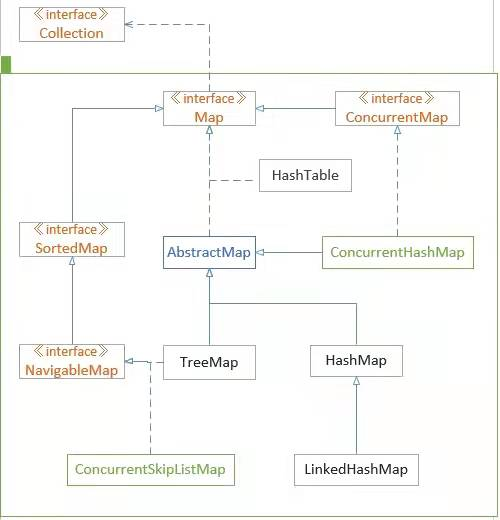
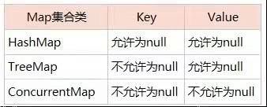
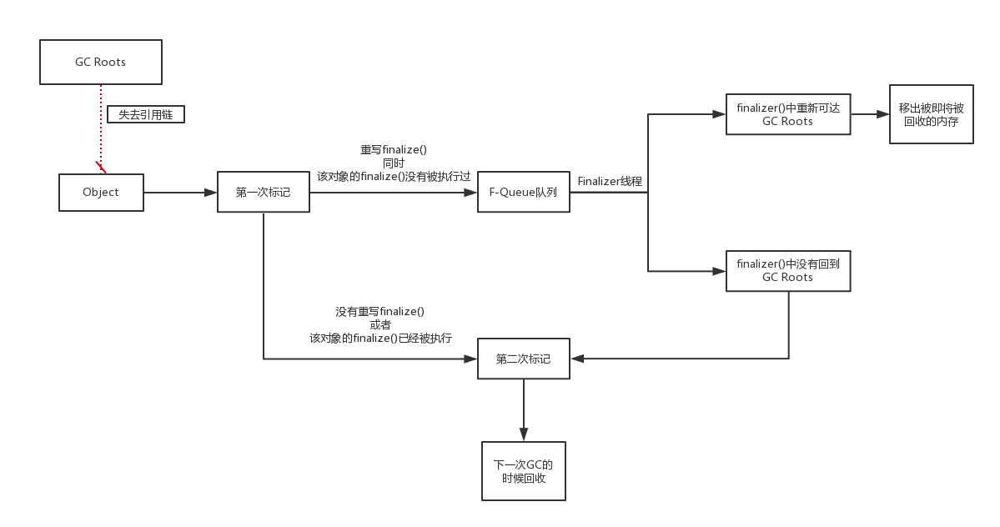

# 2021.12.29

## 构造方法

Java会给没有创建任何构造函数的类创建一个不带参数的构造函数

## 覆盖

方法的覆盖，也叫方法的重写。重写的前提，必须有继承。开发中，子类重写父类的方法，直接将父类被重写方法从权限修饰符到第一个花括号，直接复制粘贴，方法体改写即可。此时想要调用父类的被重写方法，需要用到super关键字。

## Java Thread run和start方法的区别

- run方法是线程内重写的一个方法
- 调用start方法时，才是启动了一个线程，线程此时为就绪状态。一旦获得CPU时间片，此时jvm会自动去调用相应的run方法，进入运行状态。

## Java程序执行顺序

1. 父类静态代码块，如果有多个静态代码块，按顺序执行，仅执行一遍
2. 子类静态代码块
3. 父类非静态代码块，按顺序执行，且每次执行
4. 父类构造函数。
5. 子类非静态代码块：有多个非静态代码块，按顺序执行，且每次new，每次执行
6. 子类构造函数

## Thread.sleep和wait异常

Thread.sleep()和Object.wait()都会抛出interruptedException,而wait是必须要在synchronized内使用的，wait的本意是暂时释放掉对象锁。

## Semaphore 、CyclicBarrier、CountDownLatch


### 1、Semaphore

#### 1.1、简介

Semaphore 字面意思是信号量的意思，它的作用是控制访问特定资源的线程数目

#### 1.2、方法

##### 1.2.1、构造方法

```java
public Semaphore(int permits);//permits表示许可线程的数量
public Semaphore(int permits,boolean fair);//fair表示公平性，如果这个设为true的话，下次执行的线程会是等待最久的线程
```

##### 1.2.2、重要方法

```java
public void acquire() throws InterruptedException//表示阻塞并获取许可
public void release()//表示释放许可
```

#### 1.3、使用场景

可用于流量控制，限制最大的并发访问数。

### 2、CyclicBarrier

#### 2.1简介

JDK1.5开始提供的并发编程，辅助工具类。用于并发编程。字面意思是回环栅栏，通过它可以实现让一组线程等待至某个状态之后再全部同时执行。叫做回环是因为当所有等待线程都被释放后，cyclicBarrier可以被重用。叫做栅栏，大概是描述所有线程被栅栏挡住了，当都达到时，一起跳过栅栏执行，也算形象，我们可以把这个状态就叫做barrier。

#### 2.2、方法

##### 2.2.1、构造方法

```java
public CyclicBarrier(int parties)
/**
第一个参数，表示一起执行的线程个数，第二参数，表示线程处于barrier时，一起执行之前，先执行的一个线程
**/
public CyclicBarrier(int parties, Runnable barrierAction)
```

##### 2.2.2、重要方法

让线程处于barrier状态的方法await()

```java
public int await()
public int await(long timeout, TimeUnit unit)
```

第一个默认方法，表示要等到所有的线程都处于barrier状态，才一起执行
第二个方法，指定了等待的时间，当所有线程没有都处于barrier状态，又到了指定的时间，所在的线程就继续执行了。

#### 3、底层原理

CyclicBarrier类是concurrent并发包下的一工具类。
 线程间同步阻塞是使用的是ReentrantLock，可重入锁
 线程间通信使用的是Condition，Condition 将 Object 监视器方法（wait、notify 和 notifyAll）分解成截然不同的对象，以便通过将这些对象与任意 Lock 实现组合使用。

### 3、CountDownLatch

#### 3.1、简介

​	countDown是倒计时的意思，Latch是门栓的意思，加起来的意思就是一个倒计时的门栓，它其实是作用于线程当中的，它就像一个门栓，一开始是关闭的，所有希望通过该门的线程都需要等待，然后开始倒计时，当倒计时一到，等待的所有线程都可以通过。

要注意的是，它是一次性的，打开之后就不能关上了。

#### 3.2、构造方法

```java
public CountDownLatch(int count)//count就是需要等待的线程数量
```

#### 3.3、重要方法

```java
// 调用此方法的线程会被阻塞，直到 CountDownLatch 的 count 为 0
public void await() throws InterruptedException 

// 和上面的 await() 作用基本一致，只是可以设置一个最长等待时间
public boolean await(long timeout, TimeUnit unit) throws InterruptedException

// 会将 count 减 1，直至为 0
public void countDown() 
```

# 2021.12.30

## List、Set、Map

List,Set继承了Collection接口，而Map是一个单独的接口； 

  List的子类有ArrayList、LinedList和Vector：LinedList和Vector的底层都是基于链表，而ArrayList的底层是基于线性表。LinedList和ArrayList的共同点是线程是不安全的，不同点是ArrayList在做增删元素的时候，效率高，查询效率低；linedList恰好相反；这和它们的底层有关系。 

  Set的实现类HashSet,TreeSet。这俩个类都保存了元素的唯一性，但是hashSet的元素是无需的，而TreeSet的元素是有序的。 

  Map的实现类：HashMap,HashTable它们的区别是HashMap的key可以为null，而HashTable的key不能为Null; 
  当往Map集合中放入相同的key时，前者的key会覆盖后者的key。

## 抽象类和接口不能实例化

## 泛型

泛型仅仅是java的语法糖，他不会影响java虚拟机生成的汇编代码，在编译阶段，虚拟机就会把泛型的类型擦除，还原成没有泛型的代码，顶多编译速度稍微慢一些，执行速度是完成没有什么区别的，

## 类型自动转换规则

### 概述

自动类型转换也叫隐式类型转换

### 规则

1. 若参与运算的数据类不同，则先转换成同一个类型，然后进行运算，

2. 转换按数据长度增加的方向进行，以保证精度不降低。如果一个操作数是long型，计算结果就是long型；如果一个操作数是float型，计算结果就是float型；如果一个操作数是double型，计算结果就是double型。例如int型和long型运算时，先把int量转成long型后再进行运算。

3. 所有的浮点运算都是以双精度进行的，即使仅含float单精度量运算的表达式，也要先转换成double型，再作运算。

4. char型和short型参与运算时，必须先转换成int型。

5. 在赋值运算中，赋值号两边的数据类型不同时，需要把右边表达式的类型将转换为左边变量的类型。如果右边表达式的数据类型长度比左边长时，将丢失一部分数据，这样会降低精度。

   

   

### 数据类型只会自动提升，不能自动降低

int值可以赋值给long，float，double型变量，不能赋值给byte、short、char型变量

```java
int a =66;
//没报错
long b = a;
float c = a;
double d = a;
//报错
byte e = a;
short f = a;
char g =a;
```

### Java中整数默认的数据类型是int类型

所有长度低于int的类型（byte、short、char）在运算之后结果将会被提升为int型

## java锁的种类

http://ifeve.com/java_lock_see/

# 2021.12.31

## 事务隔离

​	在操作系统中，为了有效并发读取数据的正确性，提出的事务隔离级别；为了解决更新丢失，脏读，不可重读（包括虚读和幻读）等问题，在标准SQL规范中，定义了4个事务隔离级别，分别为未授权读取，也称为读未提交（read uncommitted）；授权读取，也称为读提交（read committed）;可重复读取（repeatable read）；序列化（Serializable）

|                  | 脏读 | 不可重复读 | 幻读 |
| ---------------- | ---- | ---------- | ---- |
| read uncommitted | √    | √          | √    |
| read committed   | ×    | √          | √    |
| repeatable read  | ×    | ×          | √    |
| serializable     | ×    | ×          | ×    |

## HashMap

Map是键值对集合。其中key列就是一个集合，key不能重复，但是value可以重复。HashMap、TreeMap和Hashtable是Map的三个主要的实现类。HashTable是线程安全的，不能存储null值；HashMap不是线程安全的，可以存储null值。

## 默认类型

接口中的变量默认是public static final的，方法默认是public abstract的

## 表达式数据类型自动提升

1. 所有的byte,short,char类型的值将提升为int型；
2. 如果有一个操作数是long型，计算结果是long型；
3. 如果有一个操作数是float型，计算结果是float型；
4. 如果有一个操作数是double型，计算结果是double型；
5. 而声明为final的变量，不会被转换。

## Queue

### LinkedBlockingQueue

基于链接节点的可选限定的blocking queue。这个队列元素FIFO（先进先出）。队列的头部是队列中最长的元素。队列的尾部是队列中最短时间的元素。新元素插入队列的尾部，队列检索操作获取队列头部的元素。链接队列通常具有比基于阵列的队列更高的吞吐量，但在大多数并发应用程序中的可预测性能较低。（ps：blocking queue说明：不接受null元素；可能是容量有限的；实现被设计为主要用于生产者-消费者队列；不支持任何类型的“关闭”或者“关闭”操作，表示不再添加项目实现是线程安全的）

### PriorityQueue

1. 基于优先级堆的无限优先级queue。优先级队列的元素根据它们的有序natural ordering，或由一个Comparator在队列构造的时候提供。这取决于所使用的构造方法。优先队列不允许null元素。依靠自然排序的优先级队列也不允许插入不可比较的对象（这样做可能导致ClassCastException）
2. 该队列的头部是想对于顺序的最小元素。如果多个元素被绑定到最小值，那么头就是这些元素之一，关系被破坏。队列检索操作poll，remove，peek和element访问在队列的头部的元件。
3. 优先级队列是无限制的，但是具有管理用于在队列上存储元素的数组的大小的内部容量。它始终至少与队列大小一样大。当元素被添加到优先级队列中时，其容量会自动增长。没有规定增长政策的细节。
4. 该类及其迭代器实现Collection和Iterator接口的所有可选方法。 方法iterator()中提供的迭代器不能保证以任何特定顺序遍历优先级队列的元素。 如果需要有序遍历，请考虑使用Arrays.sort(pq.toArray()) 。
5. 请注意，此实现不同步。 如果任何线程修改队列，多线程不应同时访问PriorityQueue实例。 而是使用线程安全的PriorityBlockingQueue类。
6. 实现注意事项：此实现提供了O（log(n)）的时间入队和出队方法（ offer ， poll ， remove()和add ）; remove(Object)和contains(Object)方法的线性时间; 和恒定时间检索方法（ peek ， element和size ）。

### ConcurrentLinkedQueue

一个基于链接节点的无界线程安全队列(双端队列)，它采用先进先出的规则对节点进行排序，当我们添加一个元素的时候，它会添加到队列的尾部，当我们获取一个元素时，它会返回队列头部的元素。是许多线程将共享对公共集合的访问的适当选择。像大多数其他并发集合实现一样，此类不允许使用null元素。

## 流

### 分类

按照流是否直接与特定的地方（如磁盘、内存设备等）相连，分为节点流和处理流两类。

节点流：可以从或向一个特定的地方（节点）读写数据。如FileRead二

处理流：是对一个已存在的流的连接和封装，通过所封装的流的功能调用实现数据读写。如bufferedReader处理流的构造方法总是要带一个其他的流对象做参数，一个流对象经过其他流的多次包装，称为流的链接。

### 节点流

#### 文件

FileInputStream FileOutputStream FileReader FileWriter 文件进行处理的节点流。

#### 字符串

StringReader StringWrite对字符串进行处理的节点流

#### 数组

ByteArrayInputStream ByteArrayOutputStream CharArrayReader CharArrayWriter 对数组进行处理的节点流（对应的不再是文件，而是内存中的一个数组）。

#### 管道

PipedInputStream PipedOutputStream 

PipedReader PipedWriter 对管道进行处理节点流

### 处理流

#### 缓冲流

BufferedInputStream BufferedOutputStream BufferedReader BufferedWriter 增加缓冲功能，避免频繁读写硬盘

#### 转换流

inputStreamReader outputStreamReader 实现字节流和字符流之间的转换。

#### 数据流

DataInputStream DataOutputStream等提供将基础数据类型写入到文件中，或者读取处理。

### 流的关闭

1. 一般情况下是：先打开的后关闭，后打开的先关闭。
2. 另一种情况：看依赖关系，如果流a依赖流b，应该先关闭流a，再关闭流b。例如，处理流a依赖节点流b，应先a后b。
3. 可以只关闭处理流，不用关闭节点流。处理流关闭的时候，会调用其处理的节点流的关闭方法。

# 2022.1.1

## Java基本类型

| 变量名称 | 字节 | 位数 | 长度     |
| -------- | ---- | ---- | -------- |
| byte     | 1    | 8    | -128-127 |
| short    | 2    | 16   | -256-255 |
| int      | 4    | 32   |          |
| long     | 8    | 64   |          |
| float    | 4    | 32   |          |
| double   | 8    | 64   |          |
| char     | 2    | 16   |          |
| boolean  | 1    | 8    |          |

## 序列化

java在序列化时不hi实例化static变量和transient修饰的变量，因为static代表类的成员，transient代表对象的临时数据，被声明这种类型的数据成员不能被序列化，

## 调用子类构造方法

调用子类构造方法时，必须先调用父类构造方法，由于父类直接书写了构造方法，所以子类构造方法不能调用父类的默认构造方法，因此编译错误。

# 2022.1.2

## 接口可以多继承

## 修饰符

### private

只能在类内被访问

### 无修饰符

即使default能被这个类和所在包中的类访问

### public

任何类都可以访问

### protected 

能被这个类和包中的其他类还有他的子类访问

## ServletContext与ServletConfig

ServletContext对象：servlet容器在启动时会加载web应用，并为每个web应用创建唯一的servlet context对象，可以把ServletContext看成是一个Web应用的服务器端组件的共享内存，在ServletContext中可以存放共享数据。ServletContext对象是真正的一个全局对象，凡是web容器中的Servlet都可以访问。


     整个web应用只有唯一的一个ServletContext对象


  servletConfig对象：用于封装servlet的配置信息。从一个servlet被实例化后，对任何客户端在任何时候访问有效，但仅对servlet自身有效，一个servlet的ServletConfig对象不能被另一个servlet访问。

## 子类引用父类的静态字段

子类引用父类的静态字段，只会触发子类的加载、父类的初始化、不会导致子类初始化。而静态代码块在类初始化的时候执行。

# 2022.1.3

## 正则表达式

| \d   | 匹配一个数字字符。等价于[0-9]                                |
| ---- | ------------------------------------------------------------ |
| \D   | 匹配一个非数字字符。等价于【^0-9】                           |
| \f   | 匹配一个换页符，等价于\x0c和\cL                              |
| \n   | 匹配一个换行符，等价于\x0a和\cJ                              |
| \r   | 匹配一个回车符，等价于\x0d和\cM                              |
| \s   | 匹配任何空白字符。等价于[\f\n\r\t\v].                        |
| \S   | 匹配任何非空白字符。等价于匹配任何空白字符。等价于【^\f\n\r\t\v】 |
| \t   | 匹配一个制表符。等价于\x09和\cl                              |
| \v   | 匹配一个垂直制表符，等价于\x0b和\cK.                         |
| \w   | 匹配字母、数字、下划线。等价于【A-Za-z0-9_】                 |
| \W   | 匹配非字母、数字、下划线。等价于【A-Za-z0-9_】               |
|      |                                                              |

## 管道通信

管道通信类似于通信中半双通道的进程通信机制，一个管道可以实现双向的数据传输，而同一个时刻只能最多有一个方向的传输，不能两个方向同时进行，

## 代码优化

常见的代码优化技术有：复写传播，删除死代码，强度削弱，归纳变量删除。

# 2022.1.4

## static

static表示静态变量，归类所有，该类的所有对象公用。

## Object的方法

### 1．clone方法 

  保护方法，实现对象的浅复制，只有实现了Cloneable接口才可以调用该方法，否则抛出CloneNotSupportedException异常。 

###   2．getClass方法 

  final方法，获得运行时类型。 

###   3．toString方法 

  该方法用得比较多，一般子类都有覆盖。 

###   4．finalize方法 

  该方法用于释放资源。因为无法确定该方法什么时候被调用，很少使用。 

###   5．equals方法 

  该方法是非常重要的一个方法。一般equals和==是不一样的，但是在Object中两者是一样的。子类一般都要重写这个方法。 

###   6．hashCode方法 

  该方法用于哈希查找，重写了equals方法一般都要重写hashCode方法。这个方法在一些具有哈希功能的Collection中用到。 

  一般必须满足obj1.equals(obj2)==true。可以推出obj1.hash-
  Code()==obj2.hashCode()，但是hashCode相等不一定就满足equals。不过为了提高效率，应该尽量使上面两个条件接近等价。 

###   7．wait方法 

  wait方法就是使当前线程等待该对象的锁，当前线程必须是该对象的拥有者，也就是具有该对象的锁。wait()方法一直等待，直到获得锁或者被中断。wait(long
  timeout)设定一个超时间隔，如果在规定时间内没有获得锁就返回。 
  调用该方法后当前线程进入睡眠状态，直到以下事件发生。 
  （1）其他线程调用了该对象的notify方法。 
  （2）其他线程调用了该对象的notifyAll方法。 
  （3）其他线程调用了interrupt中断该线程。 
  （4）时间间隔到了。 

  此时该线程就可以被调度了，如果是被中断的话就抛出一个InterruptedException异常。 

###   8．notify方法 

  该方法唤醒在该对象上等待的某个线程。 

###   9．notifyAll方法 

  该方法唤醒在该对象上等待的所有线程。

## synchronized和volatile

synchronized保证三性，原子性，有序性，可见性，

volatile保证有序性，可见性。不能保证原子性。

## ThreadLocal

ThreadLocal用于创建线程的本地变量，该变量是线程之间不共享的。

## 运行内存分为线程共享线程私有

#### 私有：

java虚拟机栈，程序计数器，本地方法栈

#### 共享：

java堆，方法区

## String与StringBuffer

String和StringBuffer这两个类都被final修饰，说的是不可以被继承final修饰的对象或者引用类型，地址值不变，对象属性可变，其次。

# 2022.1.5

## java的堆内存

简单来说java的堆内存分为两块：permantspace(持久带)和heapspace.

持久带中主要存放用于存放静态类型数据，如Java Class，Method等，与垃圾收集器要收集的java对象关系不大。

而headspace分为年轻带和老年带

年轻代的垃圾回收叫Young GC（ps：对象被创建时，内存的分配首先发生在年轻代（大对象可以直接被创建在年老代），大部分的对象在创建后很快就不再使用，因此很快变得不可达，于是被年轻代的GC机制清理掉（IBM的研究表明，98%的对象都是很快消亡的），这个GC机制被称为Minor GC或叫Young GC。注意，Minor GC并不代表年轻代内存不足，它事实上只表示在Eden区上的GC），

年老代的垃圾回收叫Full GC（ps：对象如果在年轻代存活了足够长的时间而没有被清理掉（即在几次Young GC后存活了下来），则会被复制到年老代，年老代的空间一般比年轻代大，能存放更多的对象，在年老代上发生的GC次数也比年轻代少。当年老代内存不足时，将执行Major GC，也叫 Full GC。）

在年轻代中经历了N次（可配置）垃圾回收后仍然存活的对象，就会被复制到年老代中，因此可以以为年老带中存放的都是一些生命周期较长的对象。

年老代溢出原因有循环上万次的字符串处理、创建上千万个对象，在一端代码内申请上百M甚至上G的内存

持久带溢出原因动态加载了大量java类而导致溢出

## 抽象方法的访问权限

以前抽象类或者抽象方法默认是protected，jdk1.8以后改成默认default。

## 访问权限

局部内部类前不能用修饰符public和private，protected

内部类随意。

# 2022.1.6

## 二分法

### 模板一

用于查找数组中的单个索引来确定的元素或条件。

**关键属性**

- 二分查找的最基础和最基本的形式。
- 查找条件可以在不与元素的两侧进行比较的情况下确定（或使用它周围的特定元素）
- 不需要后处理，因为每一步中，你都在检查是否找到了元素。如果达到末尾，则知道未找到该元素。

**区分语法**

- 初始条件：left = 0，right=length-1；
- 终止： left > right;
- 向左查找：right = mid-1;
- 向右查找  left=mid+1;

```java
int binarySearch(int[] nums,int target){
    if(nums==nullnums.length==0){
        return -1;
    }
    int left=0,right=nums.length-1;
    while(left<=right){
        int mid = left+(right-left)/2;
        if(num[mid]==target){
            return mid;
        }else if(num[mid]<target){
            left = mid+1;
        }else if(num[mid]>target){
            right = mid-1;
        }
    }
    return -1;
}
```

### 模板二

用于查找需要访问数组中当前索引及其直接右邻居索引的元素或条件，

**关键属性**

- 一种实现二分查找的高级方法。
- 查找条件需要访问元素的直接右邻居。
- 使用元素的右邻居老确定是否满足条件，并决定是向左还是向右。
- 保证查找空间在每一步中至少有2个元素。
- 需要进行后处理。当你剩下1个元素时，循环/递归结束。需要评估剩余元素是否符合条件。

**区分语法**

- 初始条件：left = 0, right =length
- 终止：left == right
- 向左查找； right = mid；
- 向右查找：left = mid+1;

```java
int binarySeach(int nums,int target){
    if(nums==null||nums.length==0){
        return -1;
    }
    int left =0,right=nums.length;
    while(left<right){
        int mid = left+(right-left)/2;
        if(nums[mid]==target){
            return mid;
        }else if(nums[mid]<target){
            left = mid+1;
        }else {
            right = mid;
        }
    }
    if(left!=nums.length&&nums[left]==target)
        return left;
    return -1;
}
```

### 模板三

​	用于搜索需要访问当前索引及其在数组中的直接左右邻居索引的元素或条件。

**关键属性**

- 实现二分查找的另一种方法。

- 搜索条件需要访问元素的直接左右邻居。
- 使用元素的邻居来确定它是向右还是向左。
- 保证查找空间在每个步骤中至少有 3 个元素。
- 需要进行后处理。 当剩下 2 个元素时，循环 / 递归结束。 需要评估其余元素是否符合条件。

**区分语法**

- 初始条件：left = 0, right = length-1

- 终止：left + 1 == right
- 向左查找：right = mid
- 向右查找：left = mid

```java
int binarySearch(int[] nums, int target) {
    if (nums == null || nums.length == 0)
        return -1;

    int left = 0, right = nums.length - 1;
    while (left + 1 < right){
        // Prevent (left + right) overflow
        int mid = left + (right - left) / 2;
        if (nums[mid] == target) {
            return mid;
        } else if (nums[mid] < target) {
            left = mid;
        } else {
            right = mid;
        }
    }

    // Post-processing:
    // End Condition: left + 1 == right
    if(nums[left] == target) return left;
    if(nums[right] == target) return right;
    return -1;
}
```

### 总结

left + 1 < right；因为出来的时候是left + 1 = right 所以保证了两个元素；left和right都能用；排序数组中查找元素的第一个和最后一个位置
left < right 则保证了一个元素；可以用left/right
left <= right 则直接一个元素都没有；只能在while里mid赋值

# 2022.1.7

## 线程通知和唤醒

wait()、notify()和notifyAll()是Object类中的方法；Condition是在java1.5中才出现的，它用来替代传统的Object的wait(),notify()实现线程间的协作，相比使用Object的wait()、notify(),使用Condition的await()、signal()这种方式实现线程间协作更加安全和高效；

## java编译和运行命令

编译java文件->使用javac 文件名.java

执行使用 ->java 文件名

## java内存区域

### 程序计数器

程序计数器是一块较小的内存空间，它的作用可以看做是当前线程所执行的字节码的信号指示器（偏移地址）。java编译过程中产生的字节码有点类似编译原理的指令，程序计数器（程序计数器的内存空间是线程私有的），因为当执行语句时，改变的是程序计数器的内存空间，因此它不会发送内存溢出，并且程序计数器是jvm虚拟机规范中唯一个没有规定OutOfMemoryError异常的区域；

### Java虚拟机栈

线程私有。生命周期和线程一致。描述的是Java方法执行的内存模型；每个方法在执行时都会创建一个栈帧（Stack Frame）用于存储局部变量表、操作数栈，动态链接，方法出口等信息。每一个方法从调用直至执行结束，就对应着一个栈帧从虚拟机栈中入栈到出栈的过程。没有类信息，类信息是在方法区中。

### JAVA堆

对于绝大数应用来说，这块区域是JVM所管理的内存中最大的一块。线程共享，主要是存放对象实例和数组

### 方法区

属于共享内存区域，存储已被虚拟机加载的类的信息，常量、静态变量、即时编译器编译后的代码等数据

# 2022.1.8

## 识别合法的构造方法

1. 构造方法可以被重载，一个构造方法可以通过this关键字调用另一个构造方法，this语句必须位于构造方的第一行；
2. 当一个类中没有定义任何构造方法，java将自动提供一个缺省构造方法。
3. 子类通过super关键字调用父类的一个构造方法。
4. 当子类的某个构造方法没有通过super关键字调用父类的构造方法，通过这个构造方法创建子类对象时，会自动先调用父类的缺省构造方法。
5. 构造方法不能被static，final、synchronized、abstract、native修饰，但是可以被public、private、protected修饰；
6. 构造方不是类的成员方法。
7. 构造方法不能被继承

## 执行顺序

静态代码块>main() >构造代码块>构造方法

## Final关键字

1. final修饰变量，则等同于常量
2. final修饰方法中的参数，称为最终参数，
3. final修饰类，则类不能被继承
4. final修饰方法，则方法不能被重写，可以重载
5. 不能修饰抽象类

# 2022.1.9

## 值传递与引用传递

**值传递**：是指在调用函数时，将实际参数复制一份传递给函数，这样在函数中修改参数时，不会影响到实际参数。其实，就是在说值传递时，只会改变形参，不会改变实参。

**引用传递**：是指在调用函数时，将实际参数的地址传递给函数，这样在函数中对参数的修改，将影响到实际参数

1）形参为基本类型时，对形参的处理不会影响实参。   

 2）形参为引用类型时，对形参的处理会影响实参。    

3）String,Integer,Double等immutable类型的特殊处理，可以理解为值传递，形参操作不会影响实参对象。

## 基本类型的默认值和取值范围

|         | 默认值   | 存储需求（字节） | 取值范围       | 示例            |
| ------- | -------- | ---------------- | -------------- | --------------- |
| byte    | 0        | 1                | -2^7^~2^7^-1   |                 |
| char    | '\u0000' | 2                | 0~2^16^-1      |                 |
| short   | 0        | 2                | -2^15^~2^15^-1 |                 |
| int     | 0        | 4                | -2^31^~2^31^-1 |                 |
| long    | 0        | 8                | -2^63~^2^63^-1 | long o=10L;;    |
| float   | 0.0f     | 4                | -2^31^~2^31^-1 | float f =10.0F; |
| double  | 0.0d     | 8                | -2^63^-2^63^-1 | double b =10.0; |
| boolean | false    | 1                | false/true     |                 |

## Servlet

servlet是线程不安全的，在Servlet类中可能会定义共享的类变量，这样在并发的多线程访问的情况下，不同的线程对成员变量的修改会引发错误。

**init方法**： 是在servlet实例创建时调用的方法，用于创建或打开任何与servlet相的资源和初始 化servlet的状态，Servlet规范保证调用init方法前不会处理任何请求  
   **service方法**：是servlet真正处理客户端传过来的请求的方法，由web容器调用，
  根据HTTP请求方法（GET、POST等），将请求分发到doGet、doPost等方法  
  **destory方法**：是在servlet实例被销毁时由web容器调用。Servlet规范确保在destroy方法调用之前所有请求的处理均完成，需要覆盖destroy方法的情况：释放任何在init方法中 打开的与servlet相关的资源存储servlet的状态

## 四类八种基本类型

### 1、整数类型

byte short int long

### 2、浮点型

float double

### 3、逻辑型

boolean

### 4、字符型

char

## 类的加载过程

1.  JVM会先去方法区中找有没有相应类的.class存在。如果有，就直接使用；如果没有，则把相关类的.class加载到方法区 
2. 在.class加载到方法区时，会分为两部分加载：先加载非静态内容，再加载静态内容 
3.  加载非静态内容：把.class中的所有非静态内容加载到方法区下的非静态区域内 
4.  加载静态内容： 
     4.1、把.class中的所有静态内容加载到方法区下的静态区域内 
     4.2、静态内容加载完成之后，对所有的静态变量进行默认初始化 
     4.3、所有的静态变量默认初始化完成之后，再进行显式初始化 
     4.4、当静态区域下的所有静态变量显式初始化完后，执行静态代码块 
5.  当静态区域下的静态代码块，执行完之后，整个类的加载就完成了。

# 2022.1.10

## 自动拆箱装箱

1. 基本型个基本型封装型进行“==”运算符的比较，基本型封装型将会自动拆箱变为基本型后再进行比较，因此Integer(0)会拆箱为int类型再进行比较，
2. 两个基本型的封装型进行equals()比较，首先equals()会比较类型，如果类型相同，则继续比较值，如果值也相同，返回true
3. 基本型封装类型调用equals(),但是参数是基本类型，这时候会进行自动装箱，基本类型转换为其封装类型。

## java类加载器

1. ### 启动类加载器

  负责将存放在 < JAVA_HOME >\lib目录中的，或者被-Xbootclasspath参数所指定的路径中的，并且是虚拟机识别的（仅按照文件名识别，如rt.jar,名字不符合的类库即使放在lib中也不会被加载）类库加载到虚拟机内存中。 

  2. ### 扩展类加载器

  扩展类加载器（Extension ClassLoader）:这个加载器由sun.misc.Launcher$ExtClassLoader实现，它负责加载<JAVA_HOME>\lib\ext目录中的，或者被java.ext.dirs系统变量所指定的路径中的所有类库，开发者可以直接使用扩展类加载器。 

  3. ### 应用程序类加载器 

  应用程序类加载器(Application ClassLoader):这个类加载器由sun.misc.Launcher$App-ClassLoader实现。由于这个类加载器是ClassLoader中的getSystemClassLoader()方法的返回值，所以一般也称它为系统类加载器。它负责加载用户类路径（classPath）上所指定的类库，开发者可以直接使用这个类加载器，如果应用程序中没有自定义过自己的类加载器，一般情况下这个就是程序中默认类加载器。

## import

import 指定的只能是目录下的类，不包括子目录。

# 2022.1.11

## JVM命令

1. jps：查看本机java进程信息
2. jstack：打印线程的栈信息，制作线程dump文件。
3. jmap：打印内存映射，制作堆dump文件
4. jstat: 性能监控工具。
5. jhat 内存分析工具
6. jconsole 简易的可视化控制台
7. jvisualvm 功能强大的控制台
8. jinfo 性能调优工具。

## 垃圾回收

垃圾回收并不是在程序结束时由系统自动回收内存空间，而是在程序运作中，一旦有不在被使用的内存空间，系统就将其回收，以便被新对象使用。

## 类型自动转换规则

### 概述

自动类型转换也叫隐式类型转换

### 规则

1. 若参与运算的数据类不同，则先转换成同一个类型，然后进行运算，

2. 转换按数据长度增加的方向进行，以保证精度不降低。如果一个操作数是long型，计算结果就是long型；如果一个操作数是float型，计算结果就是float型；如果一个操作数是double型，计算结果就是double型。例如int型和long型运算时，先把int量转成long型后再进行运算。

3. 所有的浮点运算都是以双精度进行的，即使仅含float单精度量运算的表达式，也要先转换成double型，再作运算。

4. char型和short型参与运算时，必须先转换成int型。

5. 在赋值运算中，赋值号两边的数据类型不同时，需要把右边表达式的类型将转换为左边变量的类型。如果右边表达式的数据类型长度比左边长时，将丢失一部分数据，这样会降低精度。

   

   

### 数据类型只会自动提升，不能自动降低

int值可以赋值给long，float，double型变量，不能赋值给byte、short、char型变量

```java
int a =66;
//没报错
long b = a;
float c = a;
double d = a;
//报错
byte e = a;
short f = a;
char g =a;
```

## 方法声明

- 抽象方法只可以被public 和 protected修饰；


- final可以修饰类、方法、变量，分别表示：该类不可继承、该方法不能重写、该变量是常量
- static final可以表达在一起来修饰方法，表示是该方法是静态的不可重写的方法
- private 修饰方法（这太常见的）表示私有方法，本类可以访问，外界不能访问

## Map家族的继承

Map家族的继承实现关系如下，注意一点就是顶层的Map接口与Collection接口是依赖关系：

​    

​    关于Key和Value能否为null的问题：



## ThreadLocal

### 概述

Synchronized用于线程间的数据共享，而ThreadLocal则用于线程之间的数据隔离

ThreadLocal继承Object，相当于没继承任何特殊的。

ThreadLocal没有实现任何接口

ThreadLocal并不是一个Thread，而是Thread的局部变量

### 数据隔离原理

使用一个哈希表来管理，每个线程的变量的副本，从而实现数据在线程的独立。

## forward（转发）和redirect（重定向）

### 简介

**forward（转发）**：

是服务器请求资源,服务器直接访问目标地址的URL,把那个URL的响应内容读取过来,然后把这些内容再发给浏览器.浏览器根本不知道服务器发送的内容从哪里来的,因为这个跳转过程实在服务器实现的，并不是在客户端实现的所以客户端并不知道这个跳转动作，所以它的地址栏还是原来的地址.

**redirect（重定向）**：

是服务端根据逻辑,发送一个状态码,告诉浏览器重新去请求那个地址.所以地址栏显示的是新的URL.

### 区别

1. 从地址栏显示来说
   forward是服务器请求资源,服务器直接访问目标地址的URL,把那个URL的响应内容读取过来,然后把这些内容再发给浏览器.浏览器根本不知道服务器发送的内容从哪里来的,所以它的地址栏还是原来的地址.

​		redirect是服务端根据逻辑,发送一个状态码,告诉浏览器重新去请求那个地址.所以地址栏显示的是新的URL.

2. 从数据共享来说
   forward:转发页面和转发到的页面可以共享request里面的数据.
   redirect:不能共享数据.

3. 从运用地方来说
   forward:一般用于用户登陆的时候,根据角色转发到相应的模块.
   redirect:一般用于用户注销登陆时返回主页面和跳转到其它的网站等

4. 从效率来说
   forward:高.
   redirect:低.

# 2022.1.12

## 垃圾回收算法

### Mark-Sweep(标记-清除)算法

这是最基础的垃圾回收算法，之所以说它是最基础的是因为它最容易实现，思想也是最简单的。标记-清除算法分为两个阶段：标记阶段和清除阶段。标记阶段的任务是标记出所有需要被回收的对象，清除阶段就是回收被标记的对象所占用的空间。过程如下所示


从图中可以很容易看出标记-清除算法实现起来比较容易，但是有一个比较严重的问题就是容易产生内存碎片、碎片太多可能会导致后续过程中需要为大对象分配空间时无法找到足够的空间而提前触发新的一次垃圾收集动作。

### Copying（复制）算法

为了解决Mark-Sweep算法的缺陷，Copying算法就被提了出来，它将可用内存按容量划分为大小相等的两块，每块只使用其中的一块，当这一块的内存用完了，就将还存活着的对象复制到另外一块上面，然后在把已使用的内存空间一次清理掉，这样一来就不容器出现内存碎片的问题。具体过程如下图所示


这种算法虽然实现简单，运行高效且不容易产生内存碎片，但是却对内存空间的使用做出了高昂的代价，因为能够使用的内存缩减到原来的一半。很显然，Copying算法的效率跟存活对象的数目多少有很大的关系，如果对象很多，那么Copying算法的效率将会大大降低。

### Mark-Compact(标记-整理)算法（压缩法）

为了解决Copying算法的缺陷，充分利用内存空间，提出了Mark-Compact算法。该算法标记阶段和Mark-Sweep一样，但是在完成标记之后，它不是直接清理可回收对象，而是将存活对象都向一端移动，然后清理掉端边界以外的内存。具体过程如下图所示：

算法（压缩法）.png)

### Generational Collection (分代收集)算法

分代收集算法是目前大部分JVM的垃圾收集器采用的算法。它和核心思想是根据对象存活的生命周期将内存划分为若干个不同的区域。一般情况下将堆区分为老年代（Tenured Generation）和新生代（Young Generation), 老年代的特点是每次垃圾回收时只有少量对象需要被回收，而新生代的特点是每次垃圾回收时都有大量的对象需要被回收，那么就可以根据不同代的特点采取最合适的收集算法。

**目前大部分垃圾收集器对于新生代都采取复制算法**，因为新生代中每次垃圾回收都要回收大部分对象，也就是说需要复制的操作次数较少，但是实际中并不是按照1：1的比例来划分新生代的空间的，一般来说是将新生代划分为一块较大的Eden空间和两块较小的Survivor空间，每次使用Eden空间和其中的一块Survivor空间，当进行回收时，将Eden和Survivor中还存活的对象复制到另一块Survivor空间中，然后清理掉Eden和刚才使用过的Survivor空间。

而由于**老年代的特点是每次回收都只回收少量对象，一般使用的是标记-整理算法（压缩法）**

## 典型的垃圾收集器

垃圾收集算法是 内存回收的理论基础，而垃圾收集器就是内存回收的具体实现。下面介绍一下HotSpot（JDK 7)虚拟机提供的几种垃圾收集器，用户可以根据自己的需求组合出各个年代使用的收集器。

1.Serial/Serial Old收集器 是最基本最古老的收集器，它是一个单线程收集器，并且在它进行垃圾收集时，必须暂停所有用户线程。Serial收集器是针对新生代的收集器，采用的是Copying算法，Serial Old收集器是针对老年代的收集器，采用的是Mark-Compact算法。它的优点是实现简单高效，但是缺点是会给用户带来停顿。

2.ParNew收集器 是Serial收集器的多线程版本，使用多个线程进行垃圾收集。

3.Parallel Scavenge收集器 是一个新生代的多线程收集器（并行收集器），它在回收期间不需要暂停其他用户线程，其采用的是Copying算法，该收集器与前两个收集器有所不同，它主要是为了达到一个可控的吞吐量。

4.Parallel Old收集器 是Parallel Scavenge收集器的老年代版本（并行收集器），使用多线程和Mark-Compact算法。

5.CMS（Concurrent Mark Sweep）收集器 是一种以获取最短回收停顿时间为目标的收集器，它是一种并发收集器，采用的是Mark-Sweep算法。

6.G1收集器 是当今收集器技术发展最前沿的成果，它是一款面向服务端应用的收集器，它能充分利用多CPU、多核环境。因此它是一款并行与并发收集器，并且它能建立可预测的停顿时间模型。

# 2022.1.13

## 编译看左边，运行看右边

父类型引用指向子类型对象，无法调用只在子类型里定义的方法，

## 引用类型的变量也在栈区，只是其引用的对象在堆区

## Finally中的return语句

如果finally块中有return 语句的话，它将覆盖掉函数中其他return语句。

## java数据库连接库JDBC用到哪种设计模式

桥接模式

## ServletContext

getParameter() 是获取POST/GET传递的参数值；

getInitParameter获取Tomcat的server.xml中设置Context的初始化参数

getAttribute()是获取对象容器中的数据值；

getRequestDispatcher是请求转发。

## final、finally、finalize

### final

final修饰变量，变量的引用（也就是指向的地址）不可变，但是引用的内容可以变（地址中的内容可变）

```java
final String a = "b";
a = "b"//编译通过
a = new String("c");//出错 
```

### finally

表示总执行。

### finalize

这个方法一个对象只能执行一次，只能在第一次进入被回收的队列，而且对象属于的类重写了finalize方法才会被执行。第二次进入回收队列的时候，不会再执行其finalize方法，而是直接被二次标记，在下一次GC的时候被GC。



## **ServerSocket** (int port)

创建一个serversocket 绑定在特定的端口

## **Socket**(InetAddress address, int port)]

创建一个socket流，连接到特定的端口和ip地址

## 依赖注入的动机就是减少组件之间的耦合度，使开发更为简洁

## 内部类

### **1. 静态内部类：**

  **1. 静态内部类本身==可以访问外部的静态资源，包括静态私有资源。但是不能访问非静态资源，可以不依赖外部类实例而实例化==。**

### **2. 成员内部类：**

  **1. 成员内部类本身可以访问外部的所有资源，但是==自身不能定义静态资源，因为其实例化本身就还依赖着外部类==。**

### **3. 局部内部类：**

  **1. 局部内部类就像一个局部方法，不能被访问修饰符修饰，也不能被static修饰。**

  **2. 局部内部类只能访问所在代码块或者方法中被定义为final的局部变量。**

### **4. 匿名内部类：**

  **1. 没有类名的内部类，不能使用class，extends和implements，没有构造方法。**

  **2. 多用于GUI中的事件处理。**

  **3. 不能定义静态资源**

  **4. 只能创建一个匿名内部类实例。**

  **5. 一个匿名内部类一定是在new后面的，这个匿名类必须继承一个父类或者实现一个接口。**

  **6. 匿名内部类是局部内部类的特殊形式，所以局部内部类的所有限制对匿名内部类也有效。**
