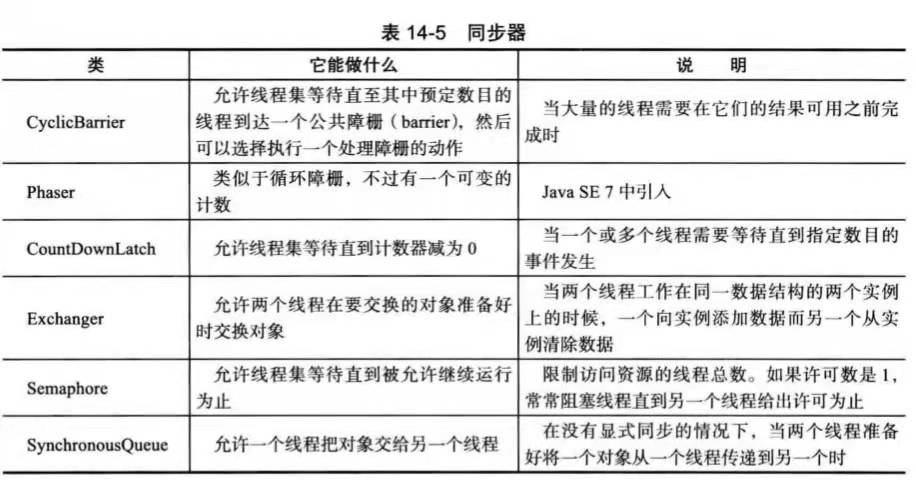
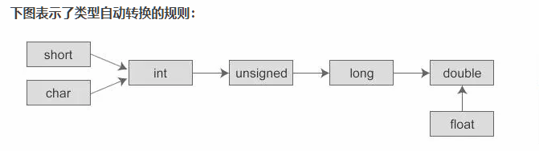

# 2021.12.29

## 构造方法

Java会给没有创建任何构造函数的类创建一个不带参数的构造函数

## 覆盖

方法的覆盖，也叫方法的重写。重写的前提，必须有继承。开发中，子类重写父类的方法，直接将父类被重写方法从权限修饰符到第一个花括号，直接复制粘贴，方法体改写即可。此时想要调用父类的被重写方法，需要用到super关键字。

## Java Thread run和start方法的区别

- run方法是线程内重写的一个方法
- 调用start方法时，才是启动了一个线程，线程此时为就绪状态。一旦获得CPU时间片，此时jvm会自动去调用相应的run方法，进入运行状态。

## Java程序执行顺序

1. 父类静态代码块，如果有多个静态代码块，按顺序执行，仅执行一遍
2. 子类静态代码块
3. 父类非静态代码块，按顺序执行，且每次执行
4. 父类构造函数。
5. 子类非静态代码块：有多个非静态代码块，按顺序执行，且每次new，每次执行
6. 子类构造函数

## Thread.sleep和wait异常

Thread.sleep()和Object.wait()都会抛出interruptedException,而wait是必须要在synchronized内使用的，wait的本意是暂时释放掉对象锁。

## Semaphore 、CyclicBarrier、CountDownLatch



### 1、Semaphore

#### 1.1、简介

Semaphore 字面意思是信号量的意思，它的作用是控制访问特定资源的线程数目

#### 1.2、方法

##### 1.2.1、构造方法

```java
public Semaphore(int permits);//permits表示许可线程的数量
public Semaphore(int permits,boolean fair);//fair表示公平性，如果这个设为true的话，下次执行的线程会是等待最久的线程
```

##### 1.2.2、重要方法

```java
public void acquire() throws InterruptedException//表示阻塞并获取许可
public void release()//表示释放许可
```

#### 1.3、使用场景

可用于流量控制，限制最大的并发访问数。

### 2、CyclicBarrier

#### 2.1简介

JDK1.5开始提供的并发编程，辅助工具类。用于并发编程。字面意思是回环栅栏，通过它可以实现让一组线程等待至某个状态之后再全部同时执行。叫做回环是因为当所有等待线程都被释放后，cyclicBarrier可以被重用。叫做栅栏，大概是描述所有线程被栅栏挡住了，当都达到时，一起跳过栅栏执行，也算形象，我们可以把这个状态就叫做barrier。

#### 2.2、方法

##### 2.2.1、构造方法

```java
public CyclicBarrier(int parties)
/**
第一个参数，表示一起执行的线程个数，第二参数，表示线程处于barrier时，一起执行之前，先执行的一个线程
**/
public CyclicBarrier(int parties, Runnable barrierAction)
```

##### 2.2.2、重要方法

让线程处于barrier状态的方法await()

```java
public int await()
public int await(long timeout, TimeUnit unit)
```

第一个默认方法，表示要等到所有的线程都处于barrier状态，才一起执行
第二个方法，指定了等待的时间，当所有线程没有都处于barrier状态，又到了指定的时间，所在的线程就继续执行了。

#### 3、底层原理

CyclicBarrier类是concurrent并发包下的一工具类。
 线程间同步阻塞是使用的是ReentrantLock，可重入锁
 线程间通信使用的是Condition，Condition 将 Object 监视器方法（wait、notify 和 notifyAll）分解成截然不同的对象，以便通过将这些对象与任意 Lock 实现组合使用。

### 3、CountDownLatch

#### 3.1、简介

​	countDown是倒计时的意思，Latch是门栓的意思，加起来的意思就是一个倒计时的门栓，它其实是作用于线程当中的，它就像一个门栓，一开始是关闭的，所有希望通过该门的线程都需要等待，然后开始倒计时，当倒计时一到，等待的所有线程都可以通过。

要注意的是，它是一次性的，打开之后就不能关上了。

#### 3.2、构造方法

```java
public CountDownLatch(int count)//count就是需要等待的线程数量
```

#### 3.3、重要方法

```java
// 调用此方法的线程会被阻塞，直到 CountDownLatch 的 count 为 0
public void await() throws InterruptedException 

// 和上面的 await() 作用基本一致，只是可以设置一个最长等待时间
public boolean await(long timeout, TimeUnit unit) throws InterruptedException

// 会将 count 减 1，直至为 0
public void countDown() 
```

# 2021.12.30

## List、Set、Map

List,Set继承了Collection接口，而Map是一个单独的接口； 

  List的子类有ArrayList、LinedList和Vector：LinedList和Vector的底层都是基于链表，而ArrayList的底层是基于线性表。LinedList和ArrayList的共同点是线程是不安全的，不同点是ArrayList在做增删元素的时候，效率高，查询效率低；linedList恰好相反；这和它们的底层有关系。 

  Set的实现类HashSet,TreeSet。这俩个类都保存了元素的唯一性，但是hashSet的元素是无需的，而TreeSet的元素是有序的。 

  Map的实现类：HashMap,HashTable它们的区别是HashMap的key可以为null，而HashTable的key不能为Null; 
  当往Map集合中放入相同的key时，前者的key会覆盖后者的key。

## 抽象类和接口不能实例化

## 泛型

泛型仅仅是java的语法糖，他不会影响java虚拟机生成的汇编代码，在编译阶段，虚拟机就会把泛型的类型擦除，还原成没有泛型的代码，顶多编译速度稍微慢一些，执行速度是完成没有什么区别的，

## 类型自动转换规则

### 概述

自动类型转换也叫隐式类型转换

### 规则

1. 若参与运算的数据类不同，则先转换成同一个类型，然后进行运算，

2. 转换按数据长度增加的方向进行，以保证精度不降低。如果一个操作数是long型，计算结果就是long型；如果一个操作数是float型，计算结果就是float型；如果一个操作数是double型，计算结果就是double型。例如int型和long型运算时，先把int量转成long型后再进行运算。

3. 所有的浮点运算都是以双精度进行的，即使仅含float单精度量运算的表达式，也要先转换成double型，再作运算。

4. char型和short型参与运算时，必须先转换成int型。

5. 在赋值运算中，赋值号两边的数据类型不同时，需要把右边表达式的类型将转换为左边变量的类型。如果右边表达式的数据类型长度比左边长时，将丢失一部分数据，这样会降低精度。

   

   

### 数据类型只会自动提升，不能自动降低

int值可以赋值给long，float，double型变量，不能赋值给byte、short、char型变量

```java
int a =66;
//没报错
long b = a;
float c = a;
double d = a;
//报错
byte e = a;
short f = a;
char g =a;
```

### Java中整数默认的数据类型是int类型

所有长度低于int的类型（byte、short、char）在运算之后结果将会被提升为int型

## java锁的种类

http://ifeve.com/java_lock_see/
