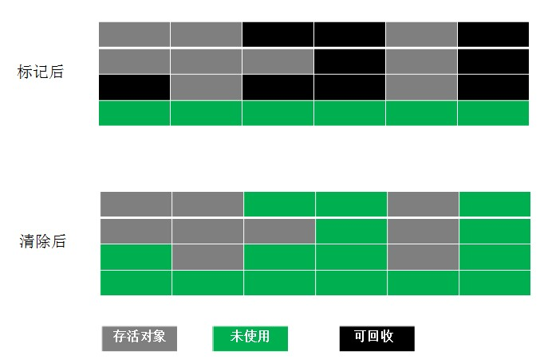
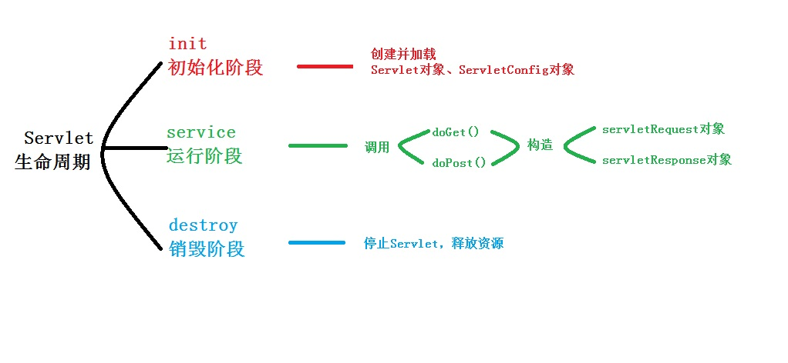

# 2021.12.29

## 构造方法

Java会给没有创建任何构造函数的类创建一个不带参数的构造函数

## 覆盖

方法的覆盖，也叫方法的重写。重写的前提，必须有继承。开发中，子类重写父类的方法，直接将父类被重写方法从权限修饰符到第一个花括号，直接复制粘贴，方法体改写即可。此时想要调用父类的被重写方法，需要用到super关键字。

## Java Thread run和start方法的区别

- run方法是线程内重写的一个方法
- 调用start方法时，才是启动了一个线程，线程此时为就绪状态。一旦获得CPU时间片，此时jvm会自动去调用相应的run方法，进入运行状态。

## Java程序执行顺序

1. 父类静态代码块，如果有多个静态代码块，按顺序执行，仅执行一遍
2. 子类静态代码块
3. 父类非静态代码块，按顺序执行，且每次执行
4. 父类构造函数。
5. 子类非静态代码块：有多个非静态代码块，按顺序执行，且每次new，每次执行
6. 子类构造函数

## Thread.sleep和wait异常

Thread.sleep()和Object.wait()都会抛出interruptedException,而wait是必须要在synchronized内使用的，wait的本意是暂时释放掉对象锁。

## Semaphore 、CyclicBarrier、CountDownLatch


### 1、Semaphore

#### 1.1、简介

Semaphore 字面意思是信号量的意思，它的作用是控制访问特定资源的线程数目

#### 1.2、方法

##### 1.2.1、构造方法

```java
public Semaphore(int permits);//permits表示许可线程的数量
public Semaphore(int permits,boolean fair);//fair表示公平性，如果这个设为true的话，下次执行的线程会是等待最久的线程
```

##### 1.2.2、重要方法

```java
public void acquire() throws InterruptedException//表示阻塞并获取许可
public void release()//表示释放许可
```

#### 1.3、使用场景

可用于流量控制，限制最大的并发访问数。

### 2、CyclicBarrier

#### 2.1简介

JDK1.5开始提供的并发编程，辅助工具类。用于并发编程。字面意思是回环栅栏，通过它可以实现让一组线程等待至某个状态之后再全部同时执行。叫做回环是因为当所有等待线程都被释放后，cyclicBarrier可以被重用。叫做栅栏，大概是描述所有线程被栅栏挡住了，当都达到时，一起跳过栅栏执行，也算形象，我们可以把这个状态就叫做barrier。

#### 2.2、方法

##### 2.2.1、构造方法

```java
public CyclicBarrier(int parties)
/**
第一个参数，表示一起执行的线程个数，第二参数，表示线程处于barrier时，一起执行之前，先执行的一个线程
**/
public CyclicBarrier(int parties, Runnable barrierAction)
```

##### 2.2.2、重要方法

让线程处于barrier状态的方法await()

```java
public int await()
public int await(long timeout, TimeUnit unit)
```

第一个默认方法，表示要等到所有的线程都处于barrier状态，才一起执行
第二个方法，指定了等待的时间，当所有线程没有都处于barrier状态，又到了指定的时间，所在的线程就继续执行了。

#### 3、底层原理

CyclicBarrier类是concurrent并发包下的一工具类。
 线程间同步阻塞是使用的是ReentrantLock，可重入锁
 线程间通信使用的是Condition，Condition 将 Object 监视器方法（wait、notify 和 notifyAll）分解成截然不同的对象，以便通过将这些对象与任意 Lock 实现组合使用。

### 3、CountDownLatch

#### 3.1、简介

​	countDown是倒计时的意思，Latch是门栓的意思，加起来的意思就是一个倒计时的门栓，它其实是作用于线程当中的，它就像一个门栓，一开始是关闭的，所有希望通过该门的线程都需要等待，然后开始倒计时，当倒计时一到，等待的所有线程都可以通过。

要注意的是，它是一次性的，打开之后就不能关上了。

#### 3.2、构造方法

```java
public CountDownLatch(int count)//count就是需要等待的线程数量
```

#### 3.3、重要方法

```java
// 调用此方法的线程会被阻塞，直到 CountDownLatch 的 count 为 0
public void await() throws InterruptedException 

// 和上面的 await() 作用基本一致，只是可以设置一个最长等待时间
public boolean await(long timeout, TimeUnit unit) throws InterruptedException

// 会将 count 减 1，直至为 0
public void countDown() 
```

# 2021.12.30

## List、Set、Map

List,Set继承了Collection接口，而Map是一个单独的接口； 

  List的子类有ArrayList、LinedList和Vector：LinedList和Vector的底层都是基于链表，而ArrayList的底层是基于线性表。LinedList和ArrayList的共同点是线程是不安全的，不同点是ArrayList在做增删元素的时候，效率高，查询效率低；linedList恰好相反；这和它们的底层有关系。 

  Set的实现类HashSet,TreeSet。这俩个类都保存了元素的唯一性，但是hashSet的元素是无需的，而TreeSet的元素是有序的。 

  Map的实现类：HashMap,HashTable它们的区别是HashMap的key可以为null，而HashTable的key不能为Null; 
  当往Map集合中放入相同的key时，前者的key会覆盖后者的key。

## 抽象类和接口不能实例化

## 泛型

泛型仅仅是java的语法糖，他不会影响java虚拟机生成的汇编代码，在编译阶段，虚拟机就会把泛型的类型擦除，还原成没有泛型的代码，顶多编译速度稍微慢一些，执行速度是完成没有什么区别的，

## 类型自动转换规则

### 概述

自动类型转换也叫隐式类型转换

### 规则

1. 若参与运算的数据类不同，则先转换成同一个类型，然后进行运算，

2. 转换按数据长度增加的方向进行，以保证精度不降低。如果一个操作数是long型，计算结果就是long型；如果一个操作数是float型，计算结果就是float型；如果一个操作数是double型，计算结果就是double型。例如int型和long型运算时，先把int量转成long型后再进行运算。

3. 所有的浮点运算都是以双精度进行的，即使仅含float单精度量运算的表达式，也要先转换成double型，再作运算。

4. char型和short型参与运算时，必须先转换成int型。

5. 在赋值运算中，赋值号两边的数据类型不同时，需要把右边表达式的类型将转换为左边变量的类型。如果右边表达式的数据类型长度比左边长时，将丢失一部分数据，这样会降低精度。

   

   

### 数据类型只会自动提升，不能自动降低

int值可以赋值给long，float，double型变量，不能赋值给byte、short、char型变量

```java
int a =66;
//没报错
long b = a;
float c = a;
double d = a;
//报错
byte e = a;
short f = a;
char g =a;
```

### Java中整数默认的数据类型是int类型

所有长度低于int的类型（byte、short、char）在运算之后结果将会被提升为int型

## java锁的种类

http://ifeve.com/java_lock_see/

# 2021.12.31

## 事务隔离

​	在操作系统中，为了有效并发读取数据的正确性，提出的事务隔离级别；为了解决更新丢失，脏读，不可重读（包括虚读和幻读）等问题，在标准SQL规范中，定义了4个事务隔离级别，分别为未授权读取，也称为读未提交（read uncommitted）；授权读取，也称为读提交（read committed）;可重复读取（repeatable read）；序列化（Serializable）

|                  | 脏读 | 不可重复读 | 幻读 |
| ---------------- | ---- | ---------- | ---- |
| read uncommitted | √    | √          | √    |
| read committed   | ×    | √          | √    |
| repeatable read  | ×    | ×          | √    |
| serializable     | ×    | ×          | ×    |

## HashMap

Map是键值对集合。其中key列就是一个集合，key不能重复，但是value可以重复。HashMap、TreeMap和Hashtable是Map的三个主要的实现类。HashTable是线程安全的，不能存储null值；HashMap不是线程安全的，可以存储null值。

## 默认类型

接口中的变量默认是public static final的，方法默认是public abstract的

## 表达式数据类型自动提升

1. 所有的byte,short,char类型的值将提升为int型；
2. 如果有一个操作数是long型，计算结果是long型；
3. 如果有一个操作数是float型，计算结果是float型；
4. 如果有一个操作数是double型，计算结果是double型；
5. 而声明为final的变量，不会被转换。

## Queue

### LinkedBlockingQueue

基于链接节点的可选限定的blocking queue。这个队列元素FIFO（先进先出）。队列的头部是队列中最长的元素。队列的尾部是队列中最短时间的元素。新元素插入队列的尾部，队列检索操作获取队列头部的元素。链接队列通常具有比基于阵列的队列更高的吞吐量，但在大多数并发应用程序中的可预测性能较低。（ps：blocking queue说明：不接受null元素；可能是容量有限的；实现被设计为主要用于生产者-消费者队列；不支持任何类型的“关闭”或者“关闭”操作，表示不再添加项目实现是线程安全的）

### PriorityQueue

1. 基于优先级堆的无限优先级queue。优先级队列的元素根据它们的有序natural ordering，或由一个Comparator在队列构造的时候提供。这取决于所使用的构造方法。优先队列不允许null元素。依靠自然排序的优先级队列也不允许插入不可比较的对象（这样做可能导致ClassCastException）
2. 该队列的头部是想对于顺序的最小元素。如果多个元素被绑定到最小值，那么头就是这些元素之一，关系被破坏。队列检索操作poll，remove，peek和element访问在队列的头部的元件。
3. 优先级队列是无限制的，但是具有管理用于在队列上存储元素的数组的大小的内部容量。它始终至少与队列大小一样大。当元素被添加到优先级队列中时，其容量会自动增长。没有规定增长政策的细节。
4. 该类及其迭代器实现Collection和Iterator接口的所有可选方法。 方法iterator()中提供的迭代器不能保证以任何特定顺序遍历优先级队列的元素。 如果需要有序遍历，请考虑使用Arrays.sort(pq.toArray()) 。
5. 请注意，此实现不同步。 如果任何线程修改队列，多线程不应同时访问PriorityQueue实例。 而是使用线程安全的PriorityBlockingQueue类。
6. 实现注意事项：此实现提供了O（log(n)）的时间入队和出队方法（ offer ， poll ， remove()和add ）; remove(Object)和contains(Object)方法的线性时间; 和恒定时间检索方法（ peek ， element和size ）。

### ConcurrentLinkedQueue

一个基于链接节点的无界线程安全队列(双端队列)，它采用先进先出的规则对节点进行排序，当我们添加一个元素的时候，它会添加到队列的尾部，当我们获取一个元素时，它会返回队列头部的元素。是许多线程将共享对公共集合的访问的适当选择。像大多数其他并发集合实现一样，此类不允许使用null元素。

## 流

### 分类

按照流是否直接与特定的地方（如磁盘、内存设备等）相连，分为节点流和处理流两类。

节点流：可以从或向一个特定的地方（节点）读写数据。如FileRead二

处理流：是对一个已存在的流的连接和封装，通过所封装的流的功能调用实现数据读写。如bufferedReader处理流的构造方法总是要带一个其他的流对象做参数，一个流对象经过其他流的多次包装，称为流的链接。

### 节点流

#### 文件

FileInputStream FileOutputStream FileReader FileWriter 文件进行处理的节点流。

#### 字符串

StringReader StringWrite对字符串进行处理的节点流

#### 数组

ByteArrayInputStream ByteArrayOutputStream CharArrayReader CharArrayWriter 对数组进行处理的节点流（对应的不再是文件，而是内存中的一个数组）。

#### 管道

PipedInputStream PipedOutputStream 

PipedReader PipedWriter 对管道进行处理节点流

### 处理流

#### 缓冲流

BufferedInputStream BufferedOutputStream BufferedReader BufferedWriter 增加缓冲功能，避免频繁读写硬盘

#### 转换流

inputStreamReader outputStreamReader 实现字节流和字符流之间的转换。

#### 数据流

DataInputStream DataOutputStream等提供将基础数据类型写入到文件中，或者读取处理。

### 流的关闭

1. 一般情况下是：先打开的后关闭，后打开的先关闭。
2. 另一种情况：看依赖关系，如果流a依赖流b，应该先关闭流a，再关闭流b。例如，处理流a依赖节点流b，应先a后b。
3. 可以只关闭处理流，不用关闭节点流。处理流关闭的时候，会调用其处理的节点流的关闭方法。

# 2022.1.1

## Java基本类型

| 变量名称 | 字节 | 位数 | 长度     |
| -------- | ---- | ---- | -------- |
| byte     | 1    | 8    | -128-127 |
| short    | 2    | 16   | -256-255 |
| int      | 4    | 32   |          |
| long     | 8    | 64   |          |
| float    | 4    | 32   |          |
| double   | 8    | 64   |          |
| char     | 2    | 16   |          |
| boolean  | 1    | 8    |          |

## 序列化

java在序列化时不hi实例化static变量和transient修饰的变量，因为static代表类的成员，transient代表对象的临时数据，被声明这种类型的数据成员不能被序列化，

## 调用子类构造方法

调用子类构造方法时，必须先调用父类构造方法，由于父类直接书写了构造方法，所以子类构造方法不能调用父类的默认构造方法，因此编译错误。

# 2022.1.2

## 接口可以多继承

## 修饰符

### private

只能在类内被访问

### 无修饰符

即使default能被这个类和所在包中的类访问

### public

任何类都可以访问

### protected 

能被这个类和包中的其他类还有他的子类访问

## ServletContext与ServletConfig

ServletContext对象：servlet容器在启动时会加载web应用，并为每个web应用创建唯一的servlet context对象，可以把ServletContext看成是一个Web应用的服务器端组件的共享内存，在ServletContext中可以存放共享数据。ServletContext对象是真正的一个全局对象，凡是web容器中的Servlet都可以访问。


     整个web应用只有唯一的一个ServletContext对象


  servletConfig对象：用于封装servlet的配置信息。从一个servlet被实例化后，对任何客户端在任何时候访问有效，但仅对servlet自身有效，一个servlet的ServletConfig对象不能被另一个servlet访问。

## 子类引用父类的静态字段

子类引用父类的静态字段，只会触发子类的加载、父类的初始化、不会导致子类初始化。而静态代码块在类初始化的时候执行。

# 2022.1.3

## 正则表达式

| \d   | 匹配一个数字字符。等价于[0-9]                                |
| ---- | ------------------------------------------------------------ |
| \D   | 匹配一个非数字字符。等价于【^0-9】                           |
| \f   | 匹配一个换页符，等价于\x0c和\cL                              |
| \n   | 匹配一个换行符，等价于\x0a和\cJ                              |
| \r   | 匹配一个回车符，等价于\x0d和\cM                              |
| \s   | 匹配任何空白字符。等价于[\f\n\r\t\v].                        |
| \S   | 匹配任何非空白字符。等价于匹配任何空白字符。等价于【^\f\n\r\t\v】 |
| \t   | 匹配一个制表符。等价于\x09和\cl                              |
| \v   | 匹配一个垂直制表符，等价于\x0b和\cK.                         |
| \w   | 匹配字母、数字、下划线。等价于【A-Za-z0-9_】                 |
| \W   | 匹配非字母、数字、下划线。等价于【A-Za-z0-9_】               |
|      |                                                              |

## 管道通信

管道通信类似于通信中半双通道的进程通信机制，一个管道可以实现双向的数据传输，而同一个时刻只能最多有一个方向的传输，不能两个方向同时进行，

## 代码优化

常见的代码优化技术有：复写传播，删除死代码，强度削弱，归纳变量删除。

# 2022.1.4

## static

static表示静态变量，归类所有，该类的所有对象公用。

## Object的方法

### 1．clone方法 

  保护方法，实现对象的浅复制，只有实现了Cloneable接口才可以调用该方法，否则抛出CloneNotSupportedException异常。 

###   2．getClass方法 

  final方法，获得运行时类型。 

###   3．toString方法 

  该方法用得比较多，一般子类都有覆盖。 

###   4．finalize方法 

  该方法用于释放资源。因为无法确定该方法什么时候被调用，很少使用。 

###   5．equals方法 

  该方法是非常重要的一个方法。一般equals和==是不一样的，但是在Object中两者是一样的。子类一般都要重写这个方法。 

###   6．hashCode方法 

  该方法用于哈希查找，重写了equals方法一般都要重写hashCode方法。这个方法在一些具有哈希功能的Collection中用到。 

  一般必须满足obj1.equals(obj2)==true。可以推出obj1.hash-
  Code()==obj2.hashCode()，但是hashCode相等不一定就满足equals。不过为了提高效率，应该尽量使上面两个条件接近等价。 

###   7．wait方法 

  wait方法就是使当前线程等待该对象的锁，当前线程必须是该对象的拥有者，也就是具有该对象的锁。wait()方法一直等待，直到获得锁或者被中断。wait(long
  timeout)设定一个超时间隔，如果在规定时间内没有获得锁就返回。 
  调用该方法后当前线程进入睡眠状态，直到以下事件发生。 
  （1）其他线程调用了该对象的notify方法。 
  （2）其他线程调用了该对象的notifyAll方法。 
  （3）其他线程调用了interrupt中断该线程。 
  （4）时间间隔到了。 

  此时该线程就可以被调度了，如果是被中断的话就抛出一个InterruptedException异常。 

###   8．notify方法 

  该方法唤醒在该对象上等待的某个线程。 

###   9．notifyAll方法 

  该方法唤醒在该对象上等待的所有线程。

## synchronized和volatile

synchronized保证三性，原子性，有序性，可见性，

volatile保证有序性，可见性。不能保证原子性。

## ThreadLocal

ThreadLocal用于创建线程的本地变量，该变量是线程之间不共享的。

## 运行内存分为线程共享线程私有

#### 私有：

java虚拟机栈，程序计数器，本地方法栈

#### 共享：

java堆，方法区

## String与StringBuffer

String和StringBuffer这两个类都被final修饰，说的是不可以被继承final修饰的对象或者引用类型，地址值不变，对象属性可变，其次。

# 2022.1.5

## java的堆内存

简单来说java的堆内存分为两块：permantspace(持久带)和heapspace.

持久带中主要存放用于存放静态类型数据，如Java Class，Method等，与垃圾收集器要收集的java对象关系不大。

而headspace分为年轻带和老年带

年轻代的垃圾回收叫Young GC（ps：对象被创建时，内存的分配首先发生在年轻代（大对象可以直接被创建在年老代），大部分的对象在创建后很快就不再使用，因此很快变得不可达，于是被年轻代的GC机制清理掉（IBM的研究表明，98%的对象都是很快消亡的），这个GC机制被称为Minor GC或叫Young GC。注意，Minor GC并不代表年轻代内存不足，它事实上只表示在Eden区上的GC），

年老代的垃圾回收叫Full GC（ps：对象如果在年轻代存活了足够长的时间而没有被清理掉（即在几次Young GC后存活了下来），则会被复制到年老代，年老代的空间一般比年轻代大，能存放更多的对象，在年老代上发生的GC次数也比年轻代少。当年老代内存不足时，将执行Major GC，也叫 Full GC。）

在年轻代中经历了N次（可配置）垃圾回收后仍然存活的对象，就会被复制到年老代中，因此可以以为年老带中存放的都是一些生命周期较长的对象。

年老代溢出原因有循环上万次的字符串处理、创建上千万个对象，在一端代码内申请上百M甚至上G的内存

持久带溢出原因动态加载了大量java类而导致溢出

## 抽象方法的访问权限

以前抽象类或者抽象方法默认是protected，jdk1.8以后改成默认default。

## 访问权限

局部内部类前不能用修饰符public和private，protected

内部类随意。

# 2022.1.6

## 二分法

### 模板一

用于查找数组中的单个索引来确定的元素或条件。

**关键属性**

- 二分查找的最基础和最基本的形式。
- 查找条件可以在不与元素的两侧进行比较的情况下确定（或使用它周围的特定元素）
- 不需要后处理，因为每一步中，你都在检查是否找到了元素。如果达到末尾，则知道未找到该元素。

**区分语法**

- 初始条件：left = 0，right=length-1；
- 终止： left > right;
- 向左查找：right = mid-1;
- 向右查找  left=mid+1;

```java
int binarySearch(int[] nums,int target){
    if(nums==nullnums.length==0){
        return -1;
    }
    int left=0,right=nums.length-1;
    while(left<=right){
        int mid = left+(right-left)/2;
        if(num[mid]==target){
            return mid;
        }else if(num[mid]<target){
            left = mid+1;
        }else if(num[mid]>target){
            right = mid-1;
        }
    }
    return -1;
}
```

### 模板二

用于查找需要访问数组中当前索引及其直接右邻居索引的元素或条件，

**关键属性**

- 一种实现二分查找的高级方法。
- 查找条件需要访问元素的直接右邻居。
- 使用元素的右邻居老确定是否满足条件，并决定是向左还是向右。
- 保证查找空间在每一步中至少有2个元素。
- 需要进行后处理。当你剩下1个元素时，循环/递归结束。需要评估剩余元素是否符合条件。

**区分语法**

- 初始条件：left = 0, right =length
- 终止：left == right
- 向左查找； right = mid；
- 向右查找：left = mid+1;

```java
int binarySeach(int nums,int target){
    if(nums==null||nums.length==0){
        return -1;
    }
    int left =0,right=nums.length;
    while(left<right){
        int mid = left+(right-left)/2;
        if(nums[mid]==target){
            return mid;
        }else if(nums[mid]<target){
            left = mid+1;
        }else {
            right = mid;
        }
    }
    if(left!=nums.length&&nums[left]==target)
        return left;
    return -1;
}
```

### 模板三

​	用于搜索需要访问当前索引及其在数组中的直接左右邻居索引的元素或条件。

**关键属性**

- 实现二分查找的另一种方法。

- 搜索条件需要访问元素的直接左右邻居。
- 使用元素的邻居来确定它是向右还是向左。
- 保证查找空间在每个步骤中至少有 3 个元素。
- 需要进行后处理。 当剩下 2 个元素时，循环 / 递归结束。 需要评估其余元素是否符合条件。

**区分语法**

- 初始条件：left = 0, right = length-1

- 终止：left + 1 == right
- 向左查找：right = mid
- 向右查找：left = mid

```java
int binarySearch(int[] nums, int target) {
    if (nums == null || nums.length == 0)
        return -1;

    int left = 0, right = nums.length - 1;
    while (left + 1 < right){
        // Prevent (left + right) overflow
        int mid = left + (right - left) / 2;
        if (nums[mid] == target) {
            return mid;
        } else if (nums[mid] < target) {
            left = mid;
        } else {
            right = mid;
        }
    }

    // Post-processing:
    // End Condition: left + 1 == right
    if(nums[left] == target) return left;
    if(nums[right] == target) return right;
    return -1;
}
```

### 总结

left + 1 < right；因为出来的时候是left + 1 = right 所以保证了两个元素；left和right都能用；排序数组中查找元素的第一个和最后一个位置
left < right 则保证了一个元素；可以用left/right
left <= right 则直接一个元素都没有；只能在while里mid赋值

# 2022.1.7

## 线程通知和唤醒

wait()、notify()和notifyAll()是Object类中的方法；Condition是在java1.5中才出现的，它用来替代传统的Object的wait(),notify()实现线程间的协作，相比使用Object的wait()、notify(),使用Condition的await()、signal()这种方式实现线程间协作更加安全和高效；

## java编译和运行命令

编译java文件->使用javac 文件名.java

执行使用 ->java 文件名

## java内存区域

### 程序计数器

程序计数器是一块较小的内存空间，它的作用可以看做是当前线程所执行的字节码的信号指示器（偏移地址）。java编译过程中产生的字节码有点类似编译原理的指令，程序计数器（程序计数器的内存空间是线程私有的），因为当执行语句时，改变的是程序计数器的内存空间，因此它不会发送内存溢出，并且程序计数器是jvm虚拟机规范中唯一个没有规定OutOfMemoryError异常的区域；

### Java虚拟机栈

线程私有。生命周期和线程一致。描述的是Java方法执行的内存模型；每个方法在执行时都会创建一个栈帧（Stack Frame）用于存储局部变量表、操作数栈，动态链接，方法出口等信息。每一个方法从调用直至执行结束，就对应着一个栈帧从虚拟机栈中入栈到出栈的过程。没有类信息，类信息是在方法区中。

### JAVA堆

对于绝大数应用来说，这块区域是JVM所管理的内存中最大的一块。线程共享，主要是存放对象实例和数组

### 方法区

属于共享内存区域，存储已被虚拟机加载的类的信息，常量、静态变量、即时编译器编译后的代码等数据

# 2022.1.8

## 识别合法的构造方法

1. 构造方法可以被重载，一个构造方法可以通过this关键字调用另一个构造方法，this语句必须位于构造方的第一行；
2. 当一个类中没有定义任何构造方法，java将自动提供一个缺省构造方法。
3. 子类通过super关键字调用父类的一个构造方法。
4. 当子类的某个构造方法没有通过super关键字调用父类的构造方法，通过这个构造方法创建子类对象时，会自动先调用父类的缺省构造方法。
5. 构造方法不能被static，final、synchronized、abstract、native修饰，但是可以被public、private、protected修饰；
6. 构造方不是类的成员方法。
7. 构造方法不能被继承

## 执行顺序

静态代码块>main() >构造代码块>构造方法

## Final关键字

1. final修饰变量，则等同于常量
2. final修饰方法中的参数，称为最终参数，
3. final修饰类，则类不能被继承
4. final修饰方法，则方法不能被重写，可以重载
5. 不能修饰抽象类

# 2022.1.9

## 值传递与引用传递

**值传递**：是指在调用函数时，将实际参数复制一份传递给函数，这样在函数中修改参数时，不会影响到实际参数。其实，就是在说值传递时，只会改变形参，不会改变实参。

**引用传递**：是指在调用函数时，将实际参数的地址传递给函数，这样在函数中对参数的修改，将影响到实际参数

1）形参为基本类型时，对形参的处理不会影响实参。   

 2）形参为引用类型时，对形参的处理会影响实参。    

3）String,Integer,Double等immutable类型的特殊处理，可以理解为值传递，形参操作不会影响实参对象。

## 基本类型的默认值和取值范围

|         | 默认值   | 存储需求（字节） | 取值范围       | 示例            |
| ------- | -------- | ---------------- | -------------- | --------------- |
| byte    | 0        | 1                | -2^7^~2^7^-1   |                 |
| char    | '\u0000' | 2                | 0~2^16^-1      |                 |
| short   | 0        | 2                | -2^15^~2^15^-1 |                 |
| int     | 0        | 4                | -2^31^~2^31^-1 |                 |
| long    | 0        | 8                | -2^63~^2^63^-1 | long o=10L;;    |
| float   | 0.0f     | 4                | -2^31^~2^31^-1 | float f =10.0F; |
| double  | 0.0d     | 8                | -2^63^-2^63^-1 | double b =10.0; |
| boolean | false    | 1                | false/true     |                 |

## Servlet

servlet是线程不安全的，在Servlet类中可能会定义共享的类变量，这样在并发的多线程访问的情况下，不同的线程对成员变量的修改会引发错误。

**init方法**： 是在servlet实例创建时调用的方法，用于创建或打开任何与servlet相的资源和初始 化servlet的状态，Servlet规范保证调用init方法前不会处理任何请求  
   **service方法**：是servlet真正处理客户端传过来的请求的方法，由web容器调用，
  根据HTTP请求方法（GET、POST等），将请求分发到doGet、doPost等方法  
  **destory方法**：是在servlet实例被销毁时由web容器调用。Servlet规范确保在destroy方法调用之前所有请求的处理均完成，需要覆盖destroy方法的情况：释放任何在init方法中 打开的与servlet相关的资源存储servlet的状态

## 四类八种基本类型

### 1、整数类型

byte short int long

### 2、浮点型

float double

### 3、逻辑型

boolean

### 4、字符型

char

## 类的加载过程

1.  JVM会先去方法区中找有没有相应类的.class存在。如果有，就直接使用；如果没有，则把相关类的.class加载到方法区 
2. 在.class加载到方法区时，会分为两部分加载：先加载非静态内容，再加载静态内容 
3.  加载非静态内容：把.class中的所有非静态内容加载到方法区下的非静态区域内 
4.  加载静态内容： 
     4.1、把.class中的所有静态内容加载到方法区下的静态区域内 
     4.2、静态内容加载完成之后，对所有的静态变量进行默认初始化 
     4.3、所有的静态变量默认初始化完成之后，再进行显式初始化 
     4.4、当静态区域下的所有静态变量显式初始化完后，执行静态代码块 
5.  当静态区域下的静态代码块，执行完之后，整个类的加载就完成了。

# 2022.1.10

## 自动拆箱装箱

1. 基本型个基本型封装型进行“==”运算符的比较，基本型封装型将会自动拆箱变为基本型后再进行比较，因此Integer(0)会拆箱为int类型再进行比较，
2. 两个基本型的封装型进行equals()比较，首先equals()会比较类型，如果类型相同，则继续比较值，如果值也相同，返回true
3. 基本型封装类型调用equals(),但是参数是基本类型，这时候会进行自动装箱，基本类型转换为其封装类型。

## java类加载器

1. ### 启动类加载器

  负责将存放在 < JAVA_HOME >\lib目录中的，或者被-Xbootclasspath参数所指定的路径中的，并且是虚拟机识别的（仅按照文件名识别，如rt.jar,名字不符合的类库即使放在lib中也不会被加载）类库加载到虚拟机内存中。 

  2. ### 扩展类加载器

  扩展类加载器（Extension ClassLoader）:这个加载器由sun.misc.Launcher$ExtClassLoader实现，它负责加载<JAVA_HOME>\lib\ext目录中的，或者被java.ext.dirs系统变量所指定的路径中的所有类库，开发者可以直接使用扩展类加载器。 

  3. ### 应用程序类加载器 

  应用程序类加载器(Application ClassLoader):这个类加载器由sun.misc.Launcher$App-ClassLoader实现。由于这个类加载器是ClassLoader中的getSystemClassLoader()方法的返回值，所以一般也称它为系统类加载器。它负责加载用户类路径（classPath）上所指定的类库，开发者可以直接使用这个类加载器，如果应用程序中没有自定义过自己的类加载器，一般情况下这个就是程序中默认类加载器。

## import

import 指定的只能是目录下的类，不包括子目录。

# 2022.1.11

## JVM命令

1. jps：查看本机java进程信息
2. jstack：打印线程的栈信息，制作线程dump文件。
3. jmap：打印内存映射，制作堆dump文件
4. jstat: 性能监控工具。
5. jhat 内存分析工具
6. jconsole 简易的可视化控制台
7. jvisualvm 功能强大的控制台
8. jinfo 性能调优工具。

## 垃圾回收

垃圾回收并不是在程序结束时由系统自动回收内存空间，而是在程序运作中，一旦有不在被使用的内存空间，系统就将其回收，以便被新对象使用。

## 类型自动转换规则

### 概述

自动类型转换也叫隐式类型转换

### 规则

1. 若参与运算的数据类不同，则先转换成同一个类型，然后进行运算，

2. 转换按数据长度增加的方向进行，以保证精度不降低。如果一个操作数是long型，计算结果就是long型；如果一个操作数是float型，计算结果就是float型；如果一个操作数是double型，计算结果就是double型。例如int型和long型运算时，先把int量转成long型后再进行运算。

3. 所有的浮点运算都是以双精度进行的，即使仅含float单精度量运算的表达式，也要先转换成double型，再作运算。

4. char型和short型参与运算时，必须先转换成int型。

5. 在赋值运算中，赋值号两边的数据类型不同时，需要把右边表达式的类型将转换为左边变量的类型。如果右边表达式的数据类型长度比左边长时，将丢失一部分数据，这样会降低精度。

   

   

### 数据类型只会自动提升，不能自动降低

int值可以赋值给long，float，double型变量，不能赋值给byte、short、char型变量

```java
int a =66;
//没报错
long b = a;
float c = a;
double d = a;
//报错
byte e = a;
short f = a;
char g =a;
```

## 方法声明

- 抽象方法只可以被public 和 protected修饰；


- final可以修饰类、方法、变量，分别表示：该类不可继承、该方法不能重写、该变量是常量
- static final可以表达在一起来修饰方法，表示是该方法是静态的不可重写的方法
- private 修饰方法（这太常见的）表示私有方法，本类可以访问，外界不能访问

## Map家族的继承

Map家族的继承实现关系如下，注意一点就是顶层的Map接口与Collection接口是依赖关系：

​    

​    关于Key和Value能否为null的问题：


## ThreadLocal

### 概述

Synchronized用于线程间的数据共享，而ThreadLocal则用于线程之间的数据隔离

ThreadLocal继承Object，相当于没继承任何特殊的。

ThreadLocal没有实现任何接口

ThreadLocal并不是一个Thread，而是Thread的局部变量

### 数据隔离原理

使用一个哈希表来管理，每个线程的变量的副本，从而实现数据在线程的独立。

## forward（转发）和redirect（重定向）

### 简介

**forward（转发）**：

是服务器请求资源,服务器直接访问目标地址的URL,把那个URL的响应内容读取过来,然后把这些内容再发给浏览器.浏览器根本不知道服务器发送的内容从哪里来的,因为这个跳转过程实在服务器实现的，并不是在客户端实现的所以客户端并不知道这个跳转动作，所以它的地址栏还是原来的地址.

**redirect（重定向）**：

是服务端根据逻辑,发送一个状态码,告诉浏览器重新去请求那个地址.所以地址栏显示的是新的URL.

### 区别

1. 从地址栏显示来说
   forward是服务器请求资源,服务器直接访问目标地址的URL,把那个URL的响应内容读取过来,然后把这些内容再发给浏览器.浏览器根本不知道服务器发送的内容从哪里来的,所以它的地址栏还是原来的地址.

​		redirect是服务端根据逻辑,发送一个状态码,告诉浏览器重新去请求那个地址.所以地址栏显示的是新的URL.

2. 从数据共享来说
   forward:转发页面和转发到的页面可以共享request里面的数据.
   redirect:不能共享数据.

3. 从运用地方来说
   forward:一般用于用户登陆的时候,根据角色转发到相应的模块.
   redirect:一般用于用户注销登陆时返回主页面和跳转到其它的网站等

4. 从效率来说
   forward:高.
   redirect:低.

# 2022.1.12

## 垃圾回收算法

### Mark-Sweep(标记-清除)算法

这是最基础的垃圾回收算法，之所以说它是最基础的是因为它最容易实现，思想也是最简单的。标记-清除算法分为两个阶段：标记阶段和清除阶段。标记阶段的任务是标记出所有需要被回收的对象，清除阶段就是回收被标记的对象所占用的空间。过程如下所示



从图中可以很容易看出标记-清除算法实现起来比较容易，但是有一个比较严重的问题就是容易产生内存碎片、碎片太多可能会导致后续过程中需要为大对象分配空间时无法找到足够的空间而提前触发新的一次垃圾收集动作。

### Copying（复制）算法

为了解决Mark-Sweep算法的缺陷，Copying算法就被提了出来，它将可用内存按容量划分为大小相等的两块，每块只使用其中的一块，当这一块的内存用完了，就将还存活着的对象复制到另外一块上面，然后在把已使用的内存空间一次清理掉，这样一来就不容器出现内存碎片的问题。具体过程如下图所示


这种算法虽然实现简单，运行高效且不容易产生内存碎片，但是却对内存空间的使用做出了高昂的代价，因为能够使用的内存缩减到原来的一半。很显然，Copying算法的效率跟存活对象的数目多少有很大的关系，如果对象很多，那么Copying算法的效率将会大大降低。

### Mark-Compact(标记-整理)算法（压缩法）

为了解决Copying算法的缺陷，充分利用内存空间，提出了Mark-Compact算法。该算法标记阶段和Mark-Sweep一样，但是在完成标记之后，它不是直接清理可回收对象，而是将存活对象都向一端移动，然后清理掉端边界以外的内存。具体过程如下图所示：

算法（压缩法）.png)

### Generational Collection (分代收集)算法

分代收集算法是目前大部分JVM的垃圾收集器采用的算法。它和核心思想是根据对象存活的生命周期将内存划分为若干个不同的区域。一般情况下将堆区分为老年代（Tenured Generation）和新生代（Young Generation), 老年代的特点是每次垃圾回收时只有少量对象需要被回收，而新生代的特点是每次垃圾回收时都有大量的对象需要被回收，那么就可以根据不同代的特点采取最合适的收集算法。

**目前大部分垃圾收集器对于新生代都采取复制算法**，因为新生代中每次垃圾回收都要回收大部分对象，也就是说需要复制的操作次数较少，但是实际中并不是按照1：1的比例来划分新生代的空间的，一般来说是将新生代划分为一块较大的Eden空间和两块较小的Survivor空间，每次使用Eden空间和其中的一块Survivor空间，当进行回收时，将Eden和Survivor中还存活的对象复制到另一块Survivor空间中，然后清理掉Eden和刚才使用过的Survivor空间。

而由于**老年代的特点是每次回收都只回收少量对象，一般使用的是标记-整理算法（压缩法）**

## 典型的垃圾收集器

垃圾收集算法是 内存回收的理论基础，而垃圾收集器就是内存回收的具体实现。下面介绍一下HotSpot（JDK 7)虚拟机提供的几种垃圾收集器，用户可以根据自己的需求组合出各个年代使用的收集器。

1.Serial/Serial Old收集器 是最基本最古老的收集器，它是一个单线程收集器，并且在它进行垃圾收集时，必须暂停所有用户线程。Serial收集器是针对新生代的收集器，采用的是Copying算法，Serial Old收集器是针对老年代的收集器，采用的是Mark-Compact算法。它的优点是实现简单高效，但是缺点是会给用户带来停顿。

2.ParNew收集器 是Serial收集器的多线程版本，使用多个线程进行垃圾收集。

3.Parallel Scavenge收集器 是一个新生代的多线程收集器（并行收集器），它在回收期间不需要暂停其他用户线程，其采用的是Copying算法，该收集器与前两个收集器有所不同，它主要是为了达到一个可控的吞吐量。

4.Parallel Old收集器 是Parallel Scavenge收集器的老年代版本（并行收集器），使用多线程和Mark-Compact算法。

5.CMS（Concurrent Mark Sweep）收集器 是一种以获取最短回收停顿时间为目标的收集器，它是一种并发收集器，采用的是Mark-Sweep算法。

6.G1收集器 是当今收集器技术发展最前沿的成果，它是一款面向服务端应用的收集器，它能充分利用多CPU、多核环境。因此它是一款并行与并发收集器，并且它能建立可预测的停顿时间模型。

# 2022.1.13

## 编译看左边，运行看右边

父类型引用指向子类型对象，无法调用只在子类型里定义的方法，

## 引用类型的变量也在栈区，只是其引用的对象在堆区

## Finally中的return语句

如果finally块中有return 语句的话，它将覆盖掉函数中其他return语句。

## java数据库连接库JDBC用到哪种设计模式

桥接模式

## ServletContext

getParameter() 是获取POST/GET传递的参数值；

getInitParameter获取Tomcat的server.xml中设置Context的初始化参数

getAttribute()是获取对象容器中的数据值；

getRequestDispatcher是请求转发。

## final、finally、finalize

### final

final修饰变量，变量的引用（也就是指向的地址）不可变，但是引用的内容可以变（地址中的内容可变）

```java
final String a = "b";
a = "b"//编译通过
a = new String("c");//出错 
```

### finally

表示总执行。

### finalize

这个方法一个对象只能执行一次，只能在第一次进入被回收的队列，而且对象属于的类重写了finalize方法才会被执行。第二次进入回收队列的时候，不会再执行其finalize方法，而是直接被二次标记，在下一次GC的时候被GC。


## **ServerSocket** (int port)

创建一个serversocket 绑定在特定的端口

## **Socket**(InetAddress address, int port)]

创建一个socket流，连接到特定的端口和ip地址

## 依赖注入的动机就是减少组件之间的耦合度，使开发更为简洁

## 内部类

### **1. 静态内部类：**

  **1. 静态内部类本身==可以访问外部的静态资源，包括静态私有资源。但是不能访问非静态资源，可以不依赖外部类实例而实例化==。**

### **2. 成员内部类：**

  **1. 成员内部类本身可以访问外部的所有资源，但是==自身不能定义静态资源，因为其实例化本身就还依赖着外部类==。**

### **3. 局部内部类：**

  **1. 局部内部类就像一个局部方法，不能被访问修饰符修饰，也不能被static修饰。**

  **2. 局部内部类只能访问所在代码块或者方法中被定义为final的局部变量。**

### **4. 匿名内部类：**

  **1. 没有类名的内部类，不能使用class，extends和implements，没有构造方法。**

  **2. 多用于GUI中的事件处理。**

  **3. 不能定义静态资源**

  **4. 只能创建一个匿名内部类实例。**

  **5. 一个匿名内部类一定是在new后面的，这个匿名类必须继承一个父类或者实现一个接口。**

  **6. 匿名内部类是局部内部类的特殊形式，所以局部内部类的所有限制对匿名内部类也有效。**

# 2022.1.14

## abstract

abstract修饰的类需要继承，而final修饰的类不可被继承。

## 抽象类使用原则

抽象方法必须为public或者protected（因为如果为private，则不能被子类继承，子类便无法实现该方法），缺省情况下默认为public；

抽象类不能直接实例化，需要依靠子类采用向上转型的方式处理；

抽象类必须有子类，使用extend是继承，一个子类只能继承一个抽象类；

子类（如果不是抽象类）则必须复写抽象类之中的全部抽象方法（如果子类没有实现父类的抽象方法，则必须将子类也定义为abstract类）

## 线程sleep，yield，wait，join

- sleep会使当前线程睡眠指定时间，不释放锁
- yield会使当前线程重回到可执行状态，等待cpu的调度，不释放锁
- wait会使当前线程回到线程池中等待，释放锁，当被其他线程使用notify,notiftAll唤醒时进入可执行状态
- 当前线程调用某线程.join()时会使当前线程等待某线程执行完毕再结束，底层调用了wait，释放锁

## 抽象类可以有构造函数，只是不能实例化，

## java系统3种加载器

启动类加载器（Bootstrap ClassLoader），扩展类加载器（Extension ClassLoader），应用程序类加载器（Application ClassLoader）

## java虚拟机中的唯一性

对任意一个类，都需要由加载器和这个类本身一同确立其在java虚拟机中的唯一性，每一个类加载器，都拥有一个独立的类名称空间。接口类是一种特殊类，因此对于同一接口不同的类装载器装载所获的类是不相同的。

## 类只需要加载一次就行，因此要保证加载过程线程安全，防止类加载多次

## 类加载器的双亲委派模型

Java程序的类加载器采用双亲委派模型，实现双亲委派的代码集中在java.lang.ClassLoader的loadClass()方法中，此方法实现的大致逻辑是：先检查是否已经被加载，若没有加载则调用父类加载器的loadClass()方法，若父类加载器为空则默认使用启动类加载器作为父类加载器。如果父类加载失败，抛出ClassNotFoundException异常

## 双亲委派模型工作过程

如果一个类加载器收到了类加载的请求，它首先不会自己去尝试加载这个类，而是把这个请求委派给父类加载器去完成，每一层次的类加载器都是如此，因此所有的加载请求最终都应该传送到顶层的启动类加载器中，只有当父加载器反馈自己无法完成这个加载请求时，子加载器才会尝试自己去加载。

## 应用程序类加载器（Application ClassLoader）

负责加载用户类路径（ClassPath）上所指定的类库，不是所有的ClassLoader都加载此路径

## java.util.Collection与java.util.Collections

java.util.Collection 是一个集合接口。它提供了对集合对象进行基本操作的通用接口方法。Collection接口在Java 类库中有很多具体的实现。Collection接口的意义是为各种具体的集合提供了最大化的统一操作方式。

java.util.Collections 是一个包装类。它包含有各种有关集合操作的静态多态方法。此类不能实例化，就像一个工具类，服务于Java的Collection框架。

# 2022.1.15

## 匿名内部类

匿名内部类的创建格式为 

```java
new 父类构造器（参数列表）|实现接口（）{
	//匿名内部类的类体实现
}
```

使用匿名内部类时，必须继承一个类或实现一个接口。

匿名内部类由于没有名字，因此不能定义构造函数

匿名内部类不能含有静态变量和静态方法

## Java有5种方式来创建对象： 

1、使用 new 关键字（最常用）： ObjectName obj = new ObjectName(); 

2、使用反射的Class类的newInstance()方法： ObjectName obj = ObjectName.class.newInstance();

 3、使用反射的Constructor类的newInstance()方法： ObjectName obj = ObjectName.class.getConstructor.newInstance(); 

4、使用对象克隆clone()方法： ObjectName obj = obj.clone(); 

5、使用反序列化（ObjectInputStream）的readObject()方法： try (ObjectInputStream ois = new ObjectInputStream(new FileInputStream(FILE_NAME))) { ObjectName obj = ois.readObject(); }

# 2022.1.16

## 线程的start和run

调用start则先执行主线程的，后执行子线程的，

调用run相当于函数调用。顺序执行。

## **[Java](http://lib.csdn.net/base/javase)中的volatile关键字的功能**

volatile是java中的一个类型修饰符。它是被设计用来修饰被不同线程访问和修改的变量。如果不加入volatile，基本上会导致这样的结果：要么无法编写多线程程序，要么编译器 失去大量优化的机会。

1，可见性

  可见性指的是在一个线程中对该变量的修改会马上由工作内存（Work Memory）写回主内存（Main Memory），所以会马上反应在其它线程的读取操作中。顺便一提，工作内存和主内存可以近似理解为实际电脑中的高速缓存和主存，工作内存是线程独享的，主存是线程共享的。

2，禁止指令重排序优化

  禁止指令重排序优化。大家知道我们写的代码（尤其是多线程代码），由于编译器优化，在实际执行的时候可能与我们编写的顺序不同。编译器只保证程序执行结果与源代码相同，却不保证实际指令的顺序与源代码相同。这在单线程看起来没什么问题，然而一旦引入多线程，这种乱序就可能导致严重问题。volatile关键字就可以从语义上解决这个问题。

  注意，禁止指令重排优化这条语义直到jdk1.5以后才能正确工作。此前的JDK中即使将变量声明为volatile也无法完全避免重排序所导致的问题。所以，在jdk1.5版本前，双重检查锁形式的单例模式是无法保证线程安全的。因此，下面的单例模式的代码，在JDK1.5之前是不能保证线程安全的。

## CopyOnWrite适用于读多写少的并发场景

## ConcurrentHashMap，读操作不需要加锁，写操作需要加锁

## yield的作用

yield()让当前正在运行的线程回到可运行状态，以允许具有相同优先级的其他线程获得运行的机会。因此，使用yield()的目的是让具有相同优先级的线程之间能够适当的轮换执行。但是，实际中无法保证yield()达到让步的目的，因为，让步的线程可能被线程调度程序再次选中。

# 2022.1.17

## 常见ASCII码

- 空格ASCII码值为32
- 数字0到9的ASCII值分别为48到57
- 大写字母A到Z的ASCII码值为65到90
- 小写字母a到z的ASCII码值为97到122。

## 常见压缩命令参数

- -s 还原文件的顺序和备份文件内的存放顺序相同。
- -t 列出备份文件的内容。
- -v 显示指令执行过程。
- -f 指定压缩文件
- -x 从备份文件中还原文件

## Math.round()  四舍五入，返回int类型

## Math.ceil()  表示向上取整，返回double类型   （ceil---天花板）

## Math.ceil()  表示向上取整，返回double类型   （ceil---天花板）

## final

1.final修饰变量，则等同于常量

2.final修饰方法中的参数，称为最终参数。

3.final修饰类，则类不能被继承

4.final修饰方法，则方法不能被重写。

5.final 不能修饰抽象类

6.final修饰的方法可以被重载 但不能被重写

# 2022.1.18

## Object类中方法及说明

```apl
registerNactives() //私有方法
getClass() //返回此Object的运行类
hashCode()//用于获取对象的哈希值。
equals(Object obj) //用于确认两个对象是否相同
clone() //创建并返回对象的一个副本
toString() //返回该对象的字符串表示。
notify() //唤醒在此对象监视器上等待的单个线程。
notifyAll() //唤醒在此对象监视器上等待的所有线程，
wait(long timeout)//在其他线程调用此对象的notify()方法或notifyAll()方法，或者超过都指定的时间量前，导致当线程等待
wait(long timeout,int nanos)//在其他线程调用此对象的notify()方法或notifyAll()方法，或者其他某个线程中断当前线程，或者已超过某个实际时间量前，导致当前线程等待
wait() //用于让当前线程失去操作权限，当前线程进入等待序列
finalize() //当垃圾回收器确定不存在对该对象的更多引用时，由对象的垃圾回收器调用此方法。               

```

## 排序算法时间复杂度与空间复杂度


|，||，&，&&

**|| 与 && 都是短路功能：**

**前者，表达式一为真，表达式二不执行。**

**后者，表达式一位假，表达式二不执行。**

**| 与 &不具备短路功能**

## Java线程的类型

### 用户线程

​	通过Thread.setDaemon(false)设置为用户线程

### 守护线程

​	通过Thead.setDaemon(true),设置为守护线程，如果不设置，默认用户线程；

守护线程是服务用户线程的线程，在它启动之前必须先set。

## 内存回收

​	内存回收程序负责释放无用内存。

​	JVM一旦启动，就会创建一个守护线程来监测是否需要有对象内存被释放。

​	无法直接释放

​	不可以指定时间，System.gc(),只是提醒jvm可以进行一次Full GC，但是什么时候真正执行，还是不知道的。

## java异常

**注意：异常和错误的区别：异常能被程序本身可以处理，错误是无法处理**


总体上我们根据Javac对异常的处理要求，将异常类分为2类。

### **非检查异常**

**非检查异常**（unckecked exception）：Error 和 RuntimeException 以及他们的子类。==javac在编译时，不会提示和发现这样的异常==，不要求在程序处理这些异常。所以如果愿意，我们可以编写代码处理（使用try...catch...finally）这样的异常，也可以不处理。对于这些异常，我们应该修正代码，而不是去通过异常处理器处理 。这样的异常发生的原因多半是代码写的有问题。如除0错误ArithmeticException，错误的强制类型转换错误ClassCastException，数组索引越界ArrayIndexOutOfBoundsException，使用了空对象NullPointerException等等。

### 检查异常

**检查异常**（checked exception）：除了Error 和 RuntimeException的其它异常。==javac强制要求程序员为这样的异常做预备处理工作==（使用try...catch...finally或者throws）。在方法中要么用try-catch语句捕获它并处理，要么用throws子句声明抛出它，否则编译不会通过。这样的异常一般是由程序的运行环境导致的。因为程序可能被运行在各种未知的环境下，而程序员无法干预用户如何使用他编写的程序，于是程序员就应该为这样的异常时刻准备着。如SQLException , IOException,ClassNotFoundException 等。

## OSI参考模型


# 2022.1.19

## hashcode和equals约定关系如下

1. 如果两个对象相等，那么他们一定有相同的哈希值
2. 如果两个对象的哈希值相等，那么这两个对象有可能相等也有可能不相等，

## 加载驱动的方法

```java
Class.forName("com.microsoft.sqlserver.jdbc.SQLServerDriver");
DriverManager.registerDriver(new com.mysql.jdbc.Driver());
System.setProperty("jdbc.drivers", "com.mysql.jdbc.Driver");
```

## Java中的char

java中的char是Unicode编码，Unicode编码占两个字节，就是16位，足够存储一个汉字。

## Properties实现了Map接口，是线程安全的

## Java关键字

​	true、false、null都不是关键字。

​	goto、const 是保留的关键字。

```apl
abstract                continue           for            new        
switch                  default            if             package     
synchronized            do                 goto           private     
this                    break              double         implements   
protected               throw              byte           else       
import                  public             throws         case       
enum                    instanceof         return         transient  
catch                   extends            int            short       
try                     char               final          interface    
static                  void               class          finally   
long                    strictfp           volatile       const      
float                   native             super          while
boolean                 assert 
```

## 变量的引用

常量池：未经 new 的常量

堆区：成员变量的引用，new 出来的变量

栈区：局部变量的引用

成员变量的引用在堆区，是因为成员变量的所属对象在堆区，所以它也在堆区。

局部变量的引用在栈区，是因为局部变量不属于某一个对象，在被调用时才被加载，所以在栈区。

## String，StringBuffer，StringBuilder的区别

### 可变与不可变

​	String 类中使用字符数组保存字符串，如下就是，因为有final修饰符，所以可以知道String对象是不可变的。String为不可变对象，一旦被创建，就不能修改它的值，对于已经存在可的String对象的修改都是重新创建一个新的对象，然后把新的值保存进去。

```
 private final char value[];
```

​	StringBuilder与StringBuffer都继承自AbstractStringBuilder类，在AbstractStringBuilder中也是使用字符数组保存字符串，如下就是，可知这两种对象都是可变的。

```java
char[] value
```

StringBuffer是一个可变对象，当对他进行修改的时候不会像String那样重新建立对象，它只能通过构造函数来建立。如：StringBuffer sb = new StringBuffer();不能通过赋值符号对他进行赋值。对象被建立以后,在内存中就会分配内存空间,并初始保存一个null.向StringBuffer中赋值的时候可以通过它的append方法.sb.append("hello");

### 线程安全

​	String中的对象是不可变的，也就可以理解为常量，显然线程安全。

​	AbstractStringBuilder是StringBuilder与StringBuffer的公共父类，定义了一些字符串的基本操作，如expandCapacity、append、insert、indexOf等公共方法。

​	**StringBuffer对方法加了同步锁或者对调用的方法加了同步锁，所以是** **线程安全的** **。看如下源码：**

```java
public synchronized StringBuffer reverse() {
	 super.reverse();
     return this ;
}

public int indexOf(String str) {
    return indexOf(str, 0);//存在 public synchronized int indexOf(String str, int fromIndex) 方法
}
```

**StringBuilder并没有对方法进行加同步锁，所以是** **非线程安全的** **。**

**StringBuilder与StringBuffer共同点**

**StringBuilder与StringBuffer有公共父类AbstractStringBuilder(** **抽象类** **)。**

**抽象类与接口的其中一个区别是：抽象类中可以定义一些子类的公共方法，子类只需要增加新的功能，不需要重复写已经存在的方法；而接口中只是对方法的申明和常量的定义。**

**StringBuilder、StringBuffer的方法都会调用AbstractStringBuilder中的公共方法，如super.append(...)。只是StringBuffer会在方法上加synchronized关键字，进行同步。**

### 效率

最后，如果程序不是多线程的，那么使用StringBuilder效率高于StringBuffer。 

效率比较String < StringBuffer < StringBuilder，但是在String S1 =“This is only a”+“simple”+“test”时，String效率最高

# 2022.1.20

## Vector&ArrayList的主要区别

1. 同步性Vector是线程安全的，也就是说是同步的，而ArrayList是线程不安全的，不是同步的

2. 数据增长：当需要增长时，Vector默认增长为原来一倍，而ArrayList却是原来的50%，这样ArrayList就有利于节约内存空间。

   如果涉及到堆栈、队列等操作，应该考虑用Vector，如果需要快速随机访问元素，应该使用ArrayList

## HashMap

1. HashMap实际上是一个“链表散列”的数据结构，即数组和链表的结合体，HashMap的底层结构是一个数组，数组中的每一项是一条链表。
2. HashMap的实例有俩个参数影响其性能：‘初始容量’和‘装填因子’
3. HashMap实现不同步，线程不安全。HashTable线程安全
4. HashMap中的key-value都是存储在Entry中的。
5. HashMap可以存null键和null值，不保证元素的顺序恒久不变，它的底层使用时数组和链表，通过hashCode()方法和equals方法保证键的唯一性，
6. 。HashMap是采用拉链法解决哈希冲突的。

## 解决冲突的方法

### 分类

​	解决冲突主要有三种方法：定址法，拉链法，再散列法

### 链表法

​	链表法是将相同hash值的对象组成一个链表放在hash值对应的槽位

### 定址法

​	当冲突发生时，使用某种探查技术在散列表中形成一个探查序列。沿此序列逐个单元地查找，直到找到给定的关键字，或者碰到一个开发的地址（即该地址单元为空）为止（若要插入，在探查到开放的地址，则可将待插入的新结点存入该地址单元）。

### 拉链法

​	拉链法解决冲突的做法是：将所有关键字为同义词的结点链接到在同一个单链表中。若选定的散列表长度为m，则可将散列定义为一个由m个头指针组成的指针数组T[0..m-1]。凡是散列地址为i的结点，均插入到以T[i]为头指针的单链表中。T中各分量的初值均应为空指针。在拉链法中，装填因子在拉链法中，装填因子α可以大于1，但一般均取α≤1。拉链法适合未规定元素的大小

## Hashtable和HashMap的区别

​	a)  继承不同。  public class Hashtable extends Dictionary implements Map public class HashMap extends  AbstractMap implements Map

​	 b) Hashtable中的方法是同步的，而HashMap中的方法在缺省情况下是非同步的。在多线程并发的环境下，可以直接使用Hashtable，但是要使用HashMap的话就要自己增加同步处理了。

 	c) Hashtable 中， key 和 value 都不允许出现 null 值。 在 HashMap 中， null 可以作为键，这样的键只有一个；可以有一个或多个键所对应的值为 null 。当 get() 方法返回 null 值时，即可以表示 HashMap 中没有该键，也可以表示该键所对应的值为 null 。因此，在 HashMap 中不能由 get() 方法来判断 HashMap 中是否存在某个键， 而应该用 containsKey() 方法来判断。 

​	d) 两个遍历方式的内部实现上不同。Hashtable、HashMap都使用了Iterator。而由于历史原因，Hashtable还使用了Enumeration的方式 。

 	e) 哈希值的使用不同，HashTable直接使用对象的hashCode。而HashMap重新计算hash值。

​	 f) Hashtable和HashMap它们两个内部实现方式的数组的初始大小和扩容的方式。HashTable中hash数组默认大小是11，增加的方式是old*2+1。HashMap中hash数组的默认大小是16，而且一定是2的指数。  注：  HashSet子类依靠hashCode()和equal()方法来区分重复元素。    HashSet内部使用Map保存数据，即将HashSet的数据作为Map的key值保存，这也是HashSet中元素不能重复的原因。而Map中保存key值的,会去判断当前Map中是否含有该Key对象，内部是先通过key的hashCode,确定有相同的hashCode之后，再通过equals方法判断是否相同。

## 创建子类的对象时，会先执行父类的构造函数。

## 子类构造器

​	子类构造器的默认第一行就是super()，默认调用直接父类的无参构造。这也就是一旦一个子类的直接父类没有无参的构造的情况下，必须在自己构造器的第一行显式的指明调用父类或者自己的哪一个构造器

## Ant和Maven

​	Ant和Maven都是基于Java的构建（build）工具。

### Ant特点

- 没有一个约定的目录结构，
- 必须明确让ant做什么，什么时候做，然后编译，打包
- 没有生命周期，必须定义目标及其实现的任务序列
- 没有集成依赖管理

### Maven特点

- 拥有约定，知道你的代码在哪里。放到哪里去
- 拥有一个生命周期，例如执行 mvn install 就可以自动执行编译，测试，打包等构建过程
- 只需要定义一个pom.xml,然后把源码放到默认的目录，Maven帮你处理其他事情
- 拥有依赖管理，仓库管理

## 抽象类

- 抽象类可以有构造方法，接口没有构造方法
- 抽象类可以有普通成员变量，接口没有普通成员变量
- 抽象类和接口都可有静态成员变量，抽象类中静态成员变量访问类型任意，接口只能public static final（默认）
- 抽象类可以没有抽象方法，抽象类可以有普通方法，接口中都是抽象方法。
- 抽象类可以有静态方法，接口不能有静态方法
- 抽象类中的方法可以是public，protected；接口方法只有public。

## HttpServletResponse设置响应头的数据

```java
public void setDateHeader(String name,long date);
public void addDateHeader(String name,long date);
public void setHeader(String name,String value);
public void addHeader(String name,String value);
public void setIntHeader(String name,int value);
public void addIntHeader(String name,int value);
```

## 值传递和引用传递

- **值传递**是将变量的一个副本传递到方法中，方法中如何操作该变量副本，都不会改变原变量的值。
- **引用传递**是将变量的内存地址传递给方法，方法操作变量时会找到保存在该地址的变量，对其进行操作。会对原变量造成影响。

# 2022.1.21

## 四大修饰符

### \- private(私有的) 

​	private可以修饰成员变量，成员方法，构造方法，不能修饰类(此刻指的是外部类，内部类不加以考虑)。被private修饰的成员只能在其修饰的本类中访问，在其他类中不能调用，但是被private修饰的成员可以通过set和get方法向外界提供访问方式 

### \- default(默认的) 

​	defalut即不写任何关键字，它可以修饰类，成员变量，成员方法，构造方法。被默认权限修饰后，其只能被本类以及同包下的其他类访问。 

### \- protected(受保护的) 

​	protected可以修饰成员变量，成员方法，构造方法，但不能修饰类(此处指的是外部类，内部类不加以考虑)。被protected修饰后，只能被同包下的其他类访问。如果不同包下的类要访问被protected修饰的成员，这个类必须是其子类。 

### \- public(公共的) 

​	public是权限最大的修饰符，他可以修饰类，成员变量，成员方法，构造方法。被public修饰后，可以再任何一个类中，不管同不同包，任意使用。 

|          | public | protected | default | private |
| -------- | ------ | --------- | ------- | ------- |
| 同一个类 | √      | √         | √       | √       |
| 同一个包 | √      | √         | √       |         |
| 子类     | √      | √         |         |         |
| 不同包   | √      |           |         |         |


## 枚举（enum）

​	枚举（enum）类型是java 5新增的特性，它是一种新的类型，允许用常量来表示特定的数据片断，而且全部都以类型安全的形式来表示，是特殊的类，可以拥有成员变量和方法。

## hashMap，hashTable，concurrentHashMap

​	hashMap在单线程中使用大大提高效率，在多线程的情况下使用hashTable来确保安全。hashTable中使用synchronized关键字来实现安全机制，但是synchronized是对整张hash表进行锁定即让线程独享整张hash表，在安全同时造成了浪费。concurrentHashMap采用分段加锁的机制来确保安全。（jdk1.8后。concurrentHashMap取消了segment分段锁，采用cas和synchronized来保证并发安全）


## java异常处理

#### throw用于抛出异常

#### throws 关键字可以在方法上声明该方法要抛出的异常、然后在方法内部通过throw抛出异常对象。

#### try是用于检测被包住的语句块是否出现异常，如果有异常，则抛出异常，并执行catch语句。

#### cacth用于捕获从try中抛出的异常并作出处理。

#### finally语句块是不管有没有出现异常都要执行的内容。

## 单例模式

### 定义

​	确保一个类只有一个实例，并提供该实例的全局访问点。这样做的好处是：有些实例，全局只需要一个就够了，使用单例模式就可以避免一个全局使用的类，频繁的创建与销毁，耗费系统资源。

## 设计要素

- 一个私有构造函数（确保只能单例类自己创建实例）
- 一个私有静态变量（确保只有一个实例）
- 一个公有静态函数（给使用者提供调用方法）

简单来说就是，单例类的构造方不让其他人修改和使用；并且单例类自己只创建一个实例，这个实例，其他人也无法修改和直接使用；然后单例类提供一个调用方法，想用这个实例，只能调用。这样就确保了全局只创建了一个实例。

### 单例模型6种实现及各实现的优缺点

#### 一、懒汉式（线程不安全）

实现

```java
public class Singleton {
    private static Singleton uniqueInstance;
    private Singleton() {}
    public static Singleton getUniqueInstance() {
        if (uniqueInstance == null) {
            uniqueInstance = new Singleton();
        }
        return uniqueInstance;
    }
}
```

**说明**：先不创建实例，当第一次被调用时，在创建实例，所以被称为懒汉式。

**优点**：延迟了实例化，如果不需要使用该类，就不会被实例化，节约了系统资源。

**缺点**：线程不安全，多线程环境下，如果多个线程同时进入了 if (uniqueInstance == null) ，若此时还未实例化，也就是uniqueInstance == null，那么就会有多个线程执行 uniqueInstance = new Singleton(); ，就会实例化多个实例；

#### 二、饿汉式（线程安全）

实现：

```java
public class Singleton{
	private static Singleton uniqueInstance = new Singleton();
	private Singleton(){
	}
	public static Singleton getUniqueInstance(){
		return uniqueInstance;
	}
}
```

**说明**：先不管需不需要使用这个实例，直接先实例化好实例（饿死鬼一样，所以称为饿汉式），然后当需要使用的时候，直接调方法就可以使用了

**优点**：提起实例化好了一个实例，避免了线程不安全问题的出现，

**缺点**：直接实例化了实例，不再延迟实例化；若系统没有使用这个实例，或者系统运行很久之后才需要使用这个实例，都会使操作系统的资源浪费。

#### （三）懒汉式（线程安全）

**实现：**

```java
public class Singleton {
    private static Singleton uniqueInstance;

    private static singleton() {
    }

    private static synchronized Singleton getUinqueInstance() {
        if (uniqueInstance == null) {
            uniqueInstance = new Singleton();
        }
        return uniqueInstance;
    }

}
```

**说明：** 实现和 线程不安全的懒汉式 几乎一样，唯一不同的点是，在get方法上 加了一把 锁。如此一来，多个线程访问，每次只有拿到锁的的线程能够进入该方法，避免了多线程不安全问题的出现。

**优点：** 延迟实例化，节约了资源，并且是线程安全的。

**缺点：** 虽然解决了线程安全问题，但是性能降低了。因为，即使实例已经实例化了，既后续不会再出现线程安全问题了，但是锁还在，每次还是只能拿到锁的线程进入该方***使线程阻塞，等待时间过长。

#### （四）双重检查锁实现（线程安全）

**实现：**

```java
public class Singleton {

    private volatile static Singleton uniqueInstance;

    private Singleton() {
    }

    public static Singleton getUniqueInstance() {
        if (uniqueInstance == null) {
            synchronized (Singleton.class) {
                if (uniqueInstance == null) {
                    uniqueInstance = new Singleton();
                }
            }
        }
        return uniqueInstance;
    }  
}
```

**说明:** 双重检查数相当于是改进了 线程安全的懒汉式。线程安全的懒汉式 的缺点是性能降低了，造成的原因是因为即使实例已经实例化，依然每次都会有锁。而现在，我们将锁的位置变了，并且多加了一个检查。 也就是，先判断实例是否已经存在，若已经存在了，则不会执行判断方法内的有锁方法了。 而如果，还没有实例化的时候，多个线程进去了，也没有事，因为里面的方法有锁，只会让一个线程进入最内层方法并实例化实例。如此一来，最多最多，也就是第一次实例化的时候，会有线程阻塞的情况，后续便不会再有线程阻塞的问题。

**为什么使用 volatile 关键字修饰了 uniqueInstance 实例变量 ？**

uniqueInstance = new Singleton(); 这段代码执行时分为三步：

1. 为 uniqueInstance 分配内存空间
2. 初始化 uniqueInstance
3. 将 uniqueInstance 指向分配的内存地址

正常的执行顺序当然是 1>2>3 ，但是由于 JVM 具有指令重排的特性，执行顺序有可能变成 1>3>2。
单线程环境时，指令重排并没有什么问题；多线程环境时，会导致有些线程可能会获取到还没初始化的实例。
例如：线程A 只执行了 1 和 3 ，此时线程B来调用 getUniqueInstance()，发现 uniqueInstance 不为空，便获取 uniqueInstance 实例，但是其实此时的 uniqueInstance 还没有初始化。

解决办法就是加一个 volatile 关键字修饰 uniqueInstance ，volatile 会禁止 JVM 的指令重排，就可以保证多线程环境下的安全运行。

**优点：** 延迟实例化，节约了资源；线程安全；并且相对于 线程安全的懒汉式，性能提高了。

**缺点：** volatile 关键字，对性能也有一些影响。

#### （五）静态内部类实现（线程安全）

**实现：**

```java
public class Singleton {

    private Singleton() {
    }

    private static class SingletonHolder {
        private static final Singleton INSTANCE = new Singleton();
    }

    public static Singleton getUniqueInstance() {
        return SingletonHolder.INSTANCE;
    }

}
```

**说明：** 首先，当外部类 Singleton 被加载时，静态内部类 SingletonHolder 并没有被加载进内存。当调用 getUniqueInstance() 方法时，会运行 return SingletonHolder.INSTANCE; ，触发了 SingletonHolder.INSTANCE ，此时静态内部类 SingletonHolder 才会被加载进内存，并且初始化 INSTANCE 实例，而且 JVM 会确保 INSTANCE 只被实例化一次。

**优点：** 延迟实例化，节约了资源；且线程安全；性能也提高了。

#### （六）枚举类实现（线程安全）

**实现：**

```java
public enum Singleton {

    INSTANCE;

    //添加自己需要的操作
    public void doSomeThing() {

    }

}
```

**说明：** 默认枚举实例的创建就是线程安全的，且在任何情况下都是单例。

**优点：** 写法简单，线程安全，天然防止反射和反序列化调用。

- **防止反序列化**
  **序列化：**把java对象转换为字节序列的过程；
  **反序列化：** 通过这些字节序列在内存中新建java对象的过程；
  **说明：** 反序列化 将一个单例实例对象写到磁盘再读回来，从而获得了一个新的实例。
  我们要防止反序列化，避免得到多个实例。
  **枚举类天然防止反序列化。**
  其他单例模式 可以通过 重写 readResolve() 方法，从而防止反序列化，使实例唯一重写 readResolve() :

```
private` `Object readResolve() ``throws` `ObjectStreamException{``    ``return` `singleton;``}
```

#### 四、单例模式的应用场景

**应用场景举例：**

- 网站计数器。
- 应用程序的日志应用。
- Web项目中的配置对象的读取。
- 数据库连接池。
- 多线程池。
- ......

**使用场景总结：**

- **频繁实例化然后又销毁的对象**，使用单例模式可以提高性能。
- **经常使用的对象，但实例化时耗费时间或者资源多**，如数据库连接池，使用单例模式，可以提高性能，降低资源损坏。
- **使用线程池之类的控制资源时**，使用单例模式，可以方便资源之间的通信。

# 2022.1.22

## statement与PreparedStatement

statement每次执行SQL语句，数据库都要执行SQL语句的编译，最好用于仅一次查询并返回结果的情形，效率高于PreparedStatement

PrepareStatement是预编译的，使用PreparedStatement有几个好处

- 安全性好，有效防止Sql注入等问题
- 对于多次重复执行的语句，使用PreparedStatment效率会更高一点，并且在这种情况下也比较适合使用batch
- 代码的可读性和可维护性。

CallableStatement接口扩展PrepareStatement，用来调用存储过程,它提供了对输出和输入/输出参数的支持。CallableStatement 接口还具有对 PreparedStatement 接口提供的输入参数的支持。垃圾回收在jvm中优先级相当相当低。


## 垃圾收集器（GC）程序开发者只能推荐JVM进行回收，但何时回收，回收哪些，程序员不能控制。

## 进入DEAD的线程，它还可以恢复，GC不会回收

## 垃圾回收在jvm中优先级相当相当低


## ThreadLocal

ThreadLocal用于线程之间的数据隔离，ThreadLocal类创建一个线程本地变量。在Thread中有一个成员变量ThreadLocals，该变量的类型是ThreadLocalMap，也就是一个Map。它的键是ThreadLocal，值为就是变量的副本。通过ThreadLocal的get()方法可以获取该线程变量的本地副本，在get方法之前要先set，否则就要重写initalValue()方法。

对于多线程资源共享的问题，同步机制采用了“以时间换空间”的方式，而ThreadLocal采用了“以空间换时间”的方式。前者仅提供一份变量，让不同的线程排队访问，而后者为每一个线程都提供了一份变量，因此可以同时访问而互不影响

## ThreadLocal的使用场景

​    数据库连接：在多线程中，如果使用懒汉式的单例模式创建Connection对象，由于该对象是共享的，那么必须要使用同步方法保证线程安全，这样当一个线程在连接数据库时，那么另外一个线程只能等待。这样就造成性能降低。如果改为哪里要连接数据库就来进行连接，那么就会频繁的对数据库进行连接，性能还是不高。这时使用ThreadLocal就可以既可以保证线程安全又可以让性能不会太低。但是ThreadLocal的缺点时占用了较多的空间。


## AOP 和 OOP的区别：

1. **面向方面编程** **AOP** 偏重业务处理过程的某个步骤或阶段，强调降低模块之间的耦合度，使代码拥有更好的移植性。

2. **面向对象编程** **(oop)** 则是对业务分析中抽取的实体进行方法和属性的封装。

**也可以说** **AOP** **是面向业务中的动词领域，** **OOP** **面向名词领域。**

# 2022.1.23


## jvm参数

-Xmx10240m：代表最大堆

 -Xms10240m：代表最小堆

 -Xmn5120m：代表新生代

 -XXSurvivorRatio=3：代表Eden:Survivor = 3  根据Generation-Collection算法(目前大部分JVM采用的算法)，一般根据对象的生存周期将堆内存分为若干不同的区域，一般情况将新生代分为Eden ，两块Survivor；   计算Survivor大小， Eden:Survivor = 3，总大小为5120,3x+x+x=5120  x=1024

新生代大部分要回收，采用Copying算法，快！

老年代 大部分不需要回收，采用Mark-Compact算法

# 2022.1.24

**如果类没有构造发方法，JVM会生成一个默认构造方法，如果定义了任意类型的构造方法，编译器都不会自动生成构造方法**

****

**~n=-n-1** 


## Mysql组合索引（复合索引）最左优先原则

​	最左优先就是说组合索引的第一个字段必须出现在查询组句中，这个索引才会被用到。只要组合索引最左边第一个出现在where中，那么不管后面的字段出现与否或者出现顺序如何，Mysql引擎都会自动调用索引来优化查询效率。


## 正则表达式的规则

1. 任意一个字符表示匹配任意对应的字符，如a匹配a，7匹配7，-匹配-。
2. []代表匹配中括号中其中任一字符，如[abc]匹配a或b或c。
3. -在中括号里面和外面代表含义不同，如在外时，就匹配-，如果在中括号内[a-b]表示匹配26个小写字母中的任一个；[a-zA-Z]匹配大小写共52个字母中任一个；[0-9]匹配十个数字中任一个。
4. ^在中括号里面和外面含义不同，如在外时，就表示开头，如 ^7[0-9]表示匹配开头是7的，且第二位是任一数字的字符串；如果在中括号里面，表示除了这个字符意外的任意字符（包括数字，特殊字符），如[ ^abc]表示匹配出去abc之外的其他任一字符，
5. .表示匹配任意的字符。
6. \d表示数字
7. \D表示非数字
8. \s表示由空字符组成，[ \t\n\r\x\f]。
9. \S表示由非空字符组成，[ ^ \s]。
10. \w表示字母、数字、下划线，[a-zA-Z0-9_]。
11.  \W表示不是由字母、数字、下划线组成。
12. ?: 表示出现0次或1次。
13. +表示出现1次或多次。
14.  *表示出现0次、1次或多次。
15.  {n}表示出现n次。
16. {n,m}表示出现n~m次。
17.  {n,}表示出现n次或n次以上。
18.  XY表示X后面跟着Y，这里X和Y分别是正则表达式的一部分。
19.  X|Y表示X或Y，比如"food|f"匹配的是foo（d或f），而"(food)|f"匹配的是food或f。
20.  (X)子表达式，将X看做是一个整体




## 方法重载

- 方法名相同	
- 方法的参数类型，参数个数不一样
- 方法的返回类型可以不相同
- 方法的修饰符可以不相同。


## 类加载过程

### 概述

​	类从被加载到虚拟机内存中开始，到卸载出内存为止，它的整个生命周期包括：加载（Loading）、验证（Verification）

，准备（Preparation） 、解析（Resolution）、初始化（Initialzation）、使用（Using）和卸载（Unloading ）7个阶段。

其中准备、验证、解析3个部分统称为连接（Linking）。如图所示。

​	

加载、验证、准备、初始化和卸载这5个阶段的顺序是确定的，类的加载过程必须按照这种顺序按部就班地开始，而解析阶段则不一定；它在某些情况下可以在初始化阶段之后再开始，这是为了支持Java语言的运行时绑定（也称为动态绑定或晚期绑定）。

### 加载

​	在加载阶段（可以参考java.lang.ClassLoader的localClass() 方法），虚拟机需要完成以下3件事件

1. 通过一个类的全限定名来获取定义此类的二进制字节流；
2. 将这个字节流所表示的静态存储结构转化为方法区的运行时数据结构
3. 在内存中生成一个代表这个类的java.lang.Class对象，作为方法区这个类的各种数据的访问入口；加载阶段和连接阶段（Linked）

的部分内容（如一部分字节码文件格式验证动作）是交叉进行的，加载阶段尚未完成，连接阶段可能已经开始，但这些夹在加载阶段之中进行的动作，仍然属于连接阶段的内容，这两个阶段的开始时间仍然保持着固定的先后顺序。

## 验证

​	验证是连接阶段的第一步，这一阶段的目的是为了确保Class文件的字节流中包含的信息符合当前虚拟机的要求，并且不会危害虚拟机自身的安全。

​	验证阶段大致会完成4个阶段的检验动作：

1. 文件格式验证：验证字节流是否符合Class文件格式的规范；例如：是否以魔术0xCAFEBABE开头、主次版本号是否在当前虚拟机的处理范围之内、常量池中的常量是否有不被支持的类型。
2. 元数据验证：对字节码描述的信息进行语义分析（注意：对比javac编译阶段的语义分析），以保证其描述的信息符合Java语言规范的要求；例如：这个类是否有父类，除了java.lang.Object之外。
3. 字节码验证：通过数据流和控制流分析，确定程序语义是合法的、符合逻辑的。
4. 符号引用验证：确保解析动作能正确执行。

验证阶段是非常重要的，但不是必须的，它对程序运行期没有影响，如果所引用的类经过反复验证，那么可以考虑采用-Xverifynone参数来关闭大部分的类验证措施，以缩短虚拟机类加载的时间。

### **准备**

​	准备阶段是正式为类变量分配内存并设置类变量初始值的阶段，这些变量所使用的内存都将在方法区中进行分配。这时候进行内存分配的仅包括类变量（被static修饰的变量），而不包括实例变量，实例变量将会在对象实例化时随着对象一起分配在堆中。其次，这里所说的初始值“通常情况”下是数据类型的零值，假设一个类变量的定义为：

| 1    | publicstaticintvalue=123; |
| ---- | ------------------------- |
|      |                           |

​	那变量value在准备阶段过后的初始值为0而不是123.因为这时候尚未开始执行任何java方法，而把value赋值为123的putstatic指令是程序被编译后，存放于类构造器()方法之中，所以把value赋值为123的动作将在初始化阶段才会执行。
至于“特殊情况”是指：public static final int value=123，即当类字段的字段属性是ConstantValue时，会在准备阶段初始化为指定的值，所以标注为final之后，value的值在准备阶段初始化为123而非0.

### **解析**

​	解析阶段是虚拟机将常量池内的符号引用替换为直接引用的过程。解析动作主要针对类或接口、字段、类方法、接口方法、方法类型、方法句柄和调用点限定符7类符号引用进行。

### **初始化**

​	类初始化阶段是类加载过程的最后一步，到了初始化阶段，才真正开始执行类中定义的java程序代码。在准备阶段，变量已经付过一次系统要求的初始值，而在初始化阶段，则根据程序猿通过程序制定的主管计划去初始化类变量和其他资源，或者说：初始化阶段是执行类构造器<clinit>()方法的过程.

<clinit>()方法是由编译器自动收集类中的所有类变量的赋值动作和静态语句块static{}中的语句合并产生的，编译器收集的顺序是由语句在源文件中出现的顺序所决定的，静态语句块只能访问到定义在静态语句块之前的变量，定义在它之后的变量，在前面的静态语句块可以赋值，但是不能访问

# 2022.1.25

## spring事务

1. spring本身并不去直接管理事务，而是提供了事务管理器接口，对于不同的框架或者数据源则用不同的事务管理器；而对于事务，它把相关的属性都封装到一个实体里去了，有以下的属性

   ```java
   int propagationBehavior; /**事务的传播行为**/
   int isolationLevel；/**事务隔离级别**/
   int timeout; /**事务完成的最短时间**/
   boolean readOnly; /**是否只读**/
   ```

   Spring提供了对编程式事务和声明式事务的支持，编程式事务是嵌在业务代码中的，而声明事务是基于xml文件配置。

2. readOnly-- 事务隔离级别，表示只读数据，不更新数据

   ```
   PROPAGATION_SUPPORTS--支持当前事务，如果当前没有事务，就以非事务方式执行。 
   PROPAGATION_MANDATORY--支持当前事务，如果当前没有事务，就抛出异常。 
   PROPAGATION_REQUIRES_NEW--新建事务，如果当前存在事务，把当前事务挂起。 
   PROPAGATION_NOT_SUPPORTED--以非事务方式执行操作，如果当前存在事务，就把当前事务挂起。 
   PROPAGATION_NEVER--以非事务方式执行，如果当前存在事务，则抛出异常。
   ```


**java.net 包中提供了两种常见的网络协议的支持：TCP、UDP，TCP和UDP是同一层的，位于IP层上层，**

## 垃圾回收相关

1. 一旦垃圾回收器准备好释放对象占用的存储空间，将首先调用其finalize（）方法，才会真正的回收对象占用的内存。
2. 线程的释放是在run（）方法结束以后，此时线程的引用可能并未释放。


**当线程在活动之前或活动期间处于正在等待、休眠或占用状态且该线程被中断时，抛出该异常**

## JAVA反射提供的功能

java反射机制主要提供了以下功能：

1. 在运行时判断任意一个对象所属的类
2. 在运行时构造任意一个类的对象
3. 在运行时判断任意一个类所具有的成员变量和方法
4. 在运行时获取泛型信息
5. 在运行时调用任意一个对象的成员变量和方法
6. 在运行时处理注解
7. 生成动态代理

# 2022.1.26

## 高并发集合

### 第一代线程安全集合

Vector Hashtable 是怎么保证线程安全的。使用synchronized修饰方法

缺点：效率低

### 第二代线程非安全集合

ArrayList、HashMap线程不安全，但是性能好，用来替代Vector、Hashtable

使用ArrayList、HashMap需要线程安全怎么办呢

使用Collections.synchronizedList(list);Collections.synchronizedMap(m);

底层使用Synchronized代码块锁，虽然也是锁住了所有的代码，但是锁在方法里边，并所在方法外边性能可以理解为稍有提高。

### 第三代线程安全集合

在大量并发情况下如何提高集合的效率和安全呢

java.util.concurrent.*

ConcurrentHashMap

CopyWriteArrayList;

CopyOnWriteArraySet

底层大都采用Lock锁，（1.8的ConcurrentHashMap不使用Lock锁），保证安全的同时，性能也很高。


## 静态变量只能在类主体中定义，不能在方法中定义


## Servlet


HttpServlet 是GenericService的子类

GenericServlet是抽象类，必须给出子类才能实例化，它给出了设计servlet的一些骨架，定义了servlet生命周期，还有一些得到名字、配置、初始化参数的方法，其设计的是和应用层协议无关的，也就是说你有可能用非http协议实现它。

HttpServlet 是子类，当然就具有GenericServlet的一切特性，还添加了doGet，doPost，doPut，doTrace等方法对应处理http协议里的命令的请求响应过程。

一般没有特殊需要，自己写的Servlet都扩展HttpServlet。

自定义Servlet时尽量不要定义成员变量，多线程环境下定义的成员变量会成为线程共享变量，导致数据不一致问题

## RMI

RMI（Remote Method invocation）远程方法调用是一种计算机之间利用远程对象互相调用实现双方通讯机制。RMI采用的是TCP/IP协议。


# 2022.1.27

## Thread.yield()

yield（）方法作用是：暂停正在执行的线程对象，并执行其他线程。yield()应该做的是让当前运行线程回到可运行状态，以允许具有相同优先级的其他线程获得运行机会。因此，使用yield()的目的是让相同优先级的线程之间能适当的轮转执行。但是，实际中无法保存yield()达到让步目的，因为让步的线程还有可能被线程调度再次选中。


## 垃圾收集机制


1. 新生代：（1）**所有对象创建在新生代的Eden区，当Eden区满后触发新生代的Minor GC**，将Eden区和非空闲Survivor区存活的对象复制到另一空闲的Survivor区中，（2）保证一个Survivor区是空的，**新生代Minor GC就是在两个Survivor区之间互相复制存活对象，直到Survivor区满为止**。
2. 老年代：当Survivor区也满了之后就通过MInor GC将对象复制到老年代。老年代也满了的话，就将触发Full GC，针对整个堆（包括新生代、老年代，持久代）进行垃圾回收。
3. 持久代: 持久代如果满了，将触发Full GC。


Synchronized和volatile区别

- 关键字volatile是线程同步的轻量级实现，所以volatile性能肯定比synchronized要好，并且只能修改变量，而synchronized可以修饰方法，以及代码块。
- 多线程访问volatile不会发生阻塞，而synchronized会出现阻塞
- volatile能保证数据的可见性，但不能保证原子性，而synchronized可以保证原子性，也可以间接保证可见性，因为它会将私有内存和公共内存的数据同步。
- 关键字volatile解决的下变量在多线程之间的可见性；而synchronized解决的是多线程之间资源同步问题。


## 接口实现

1. 必须实现接口中所有的方法。

   在实现类中实现接口时，**方法的名字、返回值类型、参数的个数及类型**必须与接口中的完全一致，并且**必须实现接口中的所有方法。**

2. 接口实现类相当于子类，子类的访问权限是不能比父类小的。

   接口中所有方法默认都是public，至于为什么要是public，原因在于如果不是public，那么只能在同个包下被实现，可访问权限就降低很多了，那么在实现类中，实现的类相当于子类，子类的访问权限是不能比父类小的，而在java中一个类如果没有权限的修饰符，默认是friendly(同一个包内的其它类才可访问)，所以在实现类中一定要写public


## 函数执行顺序

父类先于子类，静态先于非静态

父类静态域——> 子类静态域——> 父类成员初始化——> 父类构造块——>父类构造方法——>子类成员初始化——>子类构造块——>子类构造方法；


## 集合


ps：Map和Collection是并行的，map并未继承Collection，Map和set不重复，list可以重复                                                                                                                                                                                                                                                                                                                                                                                                                                                                                                                                                                                                                                                                                                                                                                                                                                                                                                                                                                                                                                                                                                                                                                                                                                                                                                                                                                                                                                                                                                                                                                                                                                                                                                                                                                                                                                                                                                                                                                                                                                                                                                                                                                                                                                                                                                                                                                                                                                                                                                                                                                                                                                                                                                                

线程安全的集合：vector、stack、hashtable，enumeration线程安全的，其他的都是线程不安全的

### Collection接口常用的方法

1. size（）返回集合中元素的个数
2. add（Object ob）向集合中添加一个元素
3. addAll (Colletion coll) 将形参coll包含的所有元素添加到当前集合中。
4. isEmpty() 判断这个集合是否为空
5. clear() 清空集合元素
6. contains(Object obj):判断集合中是否包含指定的obj元素
   ① 判断的依据：根据元素所在类的equals()方法进行判断
   ②明确：如果存入集合中的元素是自定义的类对象，要去：自定义类要重写equals()方法
7. constainsAll(Collection coll):判断当前集合中是否包含coll的所有元素
8. rentainAll(Collection coll):求当前集合与coll的共有集合，返回给当前集合
9. remove(Object obj):删除集合中obj元素，若删除成功，返回ture否则
10. removeAll(Collection coll):从当前集合中删除包含coll的元素
11. equals(Object obj):判断集合中的所有元素 是否相同
12. hashCode():返回集合的哈希值
13. toArray(T[] a):将集合转化为数组
    ①如有参数，返回数组的运行时类型与指定数组的运行时类型相同。
14. iterator():返回一个Iterator接口实现类的对象,进而实现集合的遍历。
15. 数组转换为集合： Arrays.asList(数组)


# 2022.1.28

## 序列化反序列化

### 通俗讲法

把看懂的转换为看不懂的，就序列化。

把看不懂的转换为看得懂的，就是反序列化。


## 中间件

​	中间件是一种独立的系统软件或服务程序，分布式应用软件借助这软件在不同的技术之间共享资源。中间件位于客户机 / 服务器的操作系统之上，管理计算机资源和网络通讯。是连接两个应用程序或独立系统的软件。相连的系统，即使他们具有不同的接口，但通过中间件互相之间仍能交换信息。执行中间件的一个关键途径的信息传递。通过中间件，应用程序可以工作于多平台或OS环境。（中间件并不能提高内核的效率，一般只是负责网络信息的分发处理）


## ServerSocket服务器，Socket客户端

## 静态方法

1. 在静态方法中可直接调用本类的静态方法，也可以使用【类名.静态方法名】调用其他类的静态方法。

2. 静态方法中可以调用实例方法，但是必须要new一个对象，不可以直接调用。

3. 静态方法不能用this调用本类的类方法，使用【new 类名().实例方法名】调用

   如果在static修饰的方法中使用this关键字，则这个关键字就无法指向合适的对象。

   因为static修饰的方法是类方法，先于任何实例存在。static修饰的方法在类加载的时候就已经存在了，实例是在创建时才在内存中生成。而this关键字总是指向当前调用该方法的对象。


## 子类调用父类方法

​	子类构造函数调用父类构造函数用Super

​	子类重写父类方法后，若想调用父类中被重写的方法， 用super

​	未被重写的方法可以直接调用。


## 类变量

被static关键字修饰的变量是静态的，静态变量随着类的加载而加载，所以也称为类变量。


ThreadLocalMap中使用开放地址法类处理散列冲突，而HashMap中使用的是分离链表法。之所以采用不同的方式主要是因为:在ThreadLocalMap中的散列值分散得十分均匀，很少会出现冲突。而且ThreadLocalMap经常需要清除无用的对象，使用纯数组更加方便，


# 2022.1.29

**j2sdk是JAVA的开发环境包它包含JDK（开发工具包，包含JRE）和JRE（运行时环境包），简称JDK。J2SDK包含很多东西，比如java language、的、Deloyment等。**

**Appletviewer 是运行applet（即Java小应用程序，是可随网页下载到客户端由浏览器解释执行的java程序）的，applet不用main方法，继承applet类即可**


## TreeSet和LinkedHashSet

TreeSet自然排序、LinkedHashSet按添加顺序排序

TreeSet使用二叉树的原理对新add（）的对象按照指定的顺序排序（升序，降序）**，每增加一个对象都会进行排序，将对象插入的二叉树指定的位置

HashSet存储元素的顺序并不是按照存入时的顺序（和List显然不同）而是按照哈希值来存的所以取数据也是按照哈希值取的

 LinkedHashSet继承于HashSet，是具有可预知迭代顺序的 Set 接口的哈希表和链接列表实现。此实现与 HashSet 的不同之外在于，后者维护着一个运行于所有条目的双重链接列表。此链接列表定义了迭代顺序，即按照将元素插入到 set 中的顺序（插入顺序）进行迭代。


## Java类成员的访问控制权限

public > protected > 同包（default） > private


**基类就是父类，也叫超类。导出类就是子类，也叫派生类**


**java.exe是java虚拟机，javadoc.exe用来制作java文档，jdb.exe是java的调试器，javaprof.exe是剖析工具**


**JAVA虚拟机中通常使用UTF-16的方式保存一个字符**

**ResourceBundle能够依据Local的不同，选择性的读取与Local对应后缀的properties文件，以达到国际化的目的。**


## CMS

CMS全称Concurrent Mark Sweep，是一款并发的、使用标记-清除算法的垃圾回收器，以牺牲吞吐量为代价来获的最短回收停顿时间的垃圾回收器，对于要求服务器响应速度的应用上，这种垃圾回收器非常适合。CMS的基础算法是：标记-清除

它的过程可以分为以下6个步骤：

- 初始标记（STW initial mark）
- 并发标记（Concurrent marking）
- 并发预清理（Concurrent precleaning）
- 重新标记 （STW remark）
- 并发清理（Concurrent sweeping）
- 并发重置（Concurrent reset）


1. 初始标记：在这个阶段，需要虚拟机停顿正在执行的任务，官方的叫法STW（Stop The Word）。这个过程从垃圾回收的“根对象”开始，只扫描到能够和“根对象”直接关联的对象，并作标记。所以这个过程虽然暂停了整个JVM，但是很快就完成了。
2. 并发标记：这个阶段紧随初始标记阶段，在初始标记的基础继续向下追溯标记。并发标记阶段，**应用程序的线程和并发标记的线程并发执行，所以用户不会感受到停顿。**
3. 并发预清理：并发预清理阶段仍然是并发的。在这个阶段，虚拟机查找在执行并发标记阶段新进入老年代的对象（可能会有一些对象从新生代晋升到老年代，或者有一些对象被分配到老年代）。通过重复扫描，减少下一个阶段“重新标记”的工作，因为下一个阶段会Stop The World
4. 重新标记：这个阶段会暂停虚拟机，收集器线程扫描在CMS堆中剩余的对象。扫描从"根对象"开始向下追溯，并发处理对象关联。
5. 并发清理：清理垃圾对象，这个阶段收集线程和应用程序线程并发执行
6. 并发重置：这个阶段，重置CMS收集器的数据结构，等待下一次垃圾回收。


**类方法是指用Static修饰的方法，普通方法叫做对象方法**


## 线程进程

1. 一个线程只能属于一个进程，而一个进程可以有多个线程，但至少有一个线程（通过说的主线程）。
2. 资源分配给进程，同一进程的所有线程共享该进程的所有资源。
3. 线程在执行过程中，需要协作同步。不同进程的线程间要利用消息通信的办法实现同步。
4. 处理机分给线程，即真正在处理机上运行的是线程。
5. 线程是指进程内的一个执行单元，也是进程内的可调度实体。


**instance是java的二元运算符，用来判断他左边的对象是否为右面类（接口，抽象类，父类）的实例**


## JVM参数配置

-Xms：1G ， 就是说初始堆大小为1G 
-Xmx：2G ， 就是说最大堆大小为2G 
-Xmn：500M ，就是说年轻代大小是500M（包括一个Eden和两个Survivor） 
-XX:MaxPermSize：64M ， 就是说设置持久代最大值为64M 
-XX:+UseConcMarkSweepGC ， 就是说使用使用CMS内存收集算法 
-XX:SurvivorRatio=3 ， 就是说Eden区与Survivor区的大小比值为3：1：1


## 运行时常量池

- 运行时常量池是什么

     ```
     运行时常量池是每一个类或接口的常量池的运行时表示形式。
     具体体现就是在java编译后生成的.class文件中，会有class常量池，也就是静态的运行时常量池。
     ```

- 运行时常量池存放的位置

  ```
  运行时常量池一直是方法区的一部分，在不同版本的jdk中，由于方法区位置的变化，运行时常量池所处的位置也不一样.JDK1.7及之前方法区位于永久代.由于一些原因在JDK1.8之后彻底祛除了永久代,用元空间代替。
  ```

- 运行时常量池存放什么？
  
  ```
     存放编译期生成的各种字面量和符号引用；（字面量和符号引用不懂的同学请自行查阅）
     运行时常量池中包含多种不同的常量，包括编译期就已经明确的数值字面量，也包括到运行期解析后才能够获得的方法或者字段引用。 此时不再是常量池中的符号地址了，这里换为真实地址。
  ```
  
- 运行时常量池与字符串常量池？
  
  ```
  字符串常量池：在JVM中，为了减少相同的字符串的重复创建，为了达到节省内存的目的。会单独开辟一块内存，用于保存字符串常量，这个内存区域被叫做字符串常量池.
  ```
  
- 字符串常量池位置？

   	JDK1.6时字符串常量池，被存放在方法区中（永久代），而到了JDK1.7，因为永久代垃圾回收频率低；而字符串使用频率比较高，不能及时回收字符串，会导致导致永久代内存不足，就被移动到了堆内存中。

# 2022.1.30

## Java程序初始化顺序（记了好多遍了）

1. 父类的静态代码块
2. 子类的静态代码块
3. 父类的普通代码块
4. 父类的构造方法
5. 子类的普通代码块
6. 子类的构造方法


**JDK1.8的ConcurrentHashMap 采用 CAS+Synchronized 保证线程安全。JDK1.7 及以前采用segment的分段锁机制实现线程安全，其中segment继承自ReentranLock，因此采用Lock锁来保证线程安全**

## Spring框架

Spring 是轻量级的控制反转（IoC）和面向切面（AOP）的容器框架。

轻量——从大小与开销两方面而言Spring都是轻量的。完整的Spring框架可以在一个大小只有1MB多的JAR文件里发布。并且Spring所需的处理开销也是微不足道的。此外，Spring是非侵入式的：典型地，Spring应用中的对象不依赖于Spring的特定类。  

   控制反转——Spring通过一种称作控制反转（IoC）的技术促进了松耦合。当应用了IoC，一个对象依赖的其它对象会通过被动的方式传递进来，而不是这个对象自己创建或者查找依赖对象。你可以认为IoC与JNDI相反——不是对象从容器中查找依赖，而是容器在对象初始化时不等对象请求就主动将依赖传递给它。  

   面向切面——Spring提供了[面向切面编程](https://baike.baidu.com/item/面向切面编程)的丰富支持，允许通过分离应用的业务逻辑与系统级服务（例如审计（auditing）和事务（transaction）管理）进行内聚性的开发。应用对象只实现它们应该做的——完成业务逻辑——仅此而已。它们并不负责（甚至是意识）其它的系统级关注点，例如日志或事务支持。  

   容器——Spring包含并管理应用对象的配置和生命周期，在这个意义上它是一种容器，你可以配置你的每个bean如何被创建——基于一个可配置原型（prototype），你的bean可以创建一个单独的实例或者每次需要时都生成一个新的实例——以及它们是如何相互关联的。然而，Spring不应该被混同于传统的重量级的EJB容器，它们经常是庞大与笨重的，难以使


spring框架是一个分层架构，由7个定义良好的模块组成。

核心容器，spring上下文，Spring AOP，Spring DAO，Spring ORM，Spring Web，Spring MVC。


this的作用其中一个就是在一个构造方法中调用另一个构造方法，格式为this(参数)；

super是调用父类的方法；

A(a)这种形式是在new一个类时使用。


## final

final修饰的方法，不允许被子类覆盖（重写）

final修饰的类，不能被继承。

final修饰的变量，不能改变值。

final修饰的引用类型，不能再指向别的东西，但是可以改变其中的内容。


## CGI（Common Gateway interface）

​	通用网关接口，简称CGI，是一种根据请求信息动态产生回应内容的技术。通过CGI，Web服务器可以将根据请求不同启动不同的外部程序，并将请求内容转发给该程序，在程序执行结束后，将执行结果作为回应返回给客户端。也就是说，对于每个请求，都要产生一个新的进程处理。因为每个进程都会占有很多服务器的资源和时间，这就导致服务器无法同时处理很多的并发请求。另外CGI程序都是与操作系统平台相关的，在互联网爆发的初期，CGI为开发互联网应用做出了很大贡献，但是随着技术的发展，开发逐渐衰落。


## Servlet

servlet 最初是在1995年由James Gosling提出的，因为使用该技术需要复杂的Web服务器支持，所以当时并没有得到重视，也就放弃了。后来随着Web应用复杂度提升，并要求提供更高的并发处理能力，Servlet被重新捡起，并在java平台上得到实现，现在提起Servlet，指的都是Java Servlet。Java Servlet 要求必须运行在web服务器当中，与web服务器之间属于分工和互补关系。确切的说，在实际运行的时候java servlet与Web服务器会融为一体， 如同一个程序一样运行在同一个Java虚拟机（JVM）当中。与CGI不同的是，Servlet对每个请求都是单独启动一个线程，而不是进程。这种处理方式大幅度地降低了系统里的进程数量，提高了系统的并发处理能力。另外因为Java Servlet是运行在虚拟机之上的，也就解决了跨平台问题。如果没有Servlet的出现，也就没有互联网的今天。
在Servlet出现之后，随着使用范围的扩大，人们发现了它的一个很大的一个弊端。那就是 **为了能够输出HTML格式内容，需要编写大量重复代码，造成不必要的重复劳动。为了解决这个问题，基于Servlet技术产生了JavaServet Pages技术，也就是JSP。Servlet和JSP两者分工协作，Servlet侧重于解决运算和业务逻辑问题，JSP则侧重于解决展示问题。** Servlet与JSP一起为Web应用开发带来了巨大的贡献，后来出现的众多Java Web应用开发框架都是基于这两种技术的，更确切的说，都是基于Servlet技术的。

****

​	servlet 处于服务器进程中，它通过多线程方式运行其service方法，一个实例可以服务于多个请求，并且其实例一般不会销毁。而CGI对每个请求都产生新的进程，服务完成后就销毁，所以效率上低于Servlet


## Servlet周期

初始化init() ——> service() 处理请求——>destory（）销毁。


# 2022.1.31

**JAVA 1.8 之后，Java接口的修饰符可以为 abstract**


**CyclicBarrier让一组线程相互等待到某一状态再执行**

**CountDownLatch是一结束个线程等待其他线程结束再执行**


## final

1. final修饰变量，则等同于常量
2. final修饰方法中的参数，称为最终参数。
3. final修饰类，则类不能被继承
4. final修饰方法，则方法不能被重写。


​	**在Java7之前，switch只能支持 byte、short、char、int或者其对应的封装类以及Enum类型。在Java7中，也支持了String类型 ，String byte short int char Enum 类型**


抽象类在方法是可以有方法体的。JDK1.8之后，接口中的方法也可以有方法体，用default关键字修饰方法。

## 方法的重写（override）两同两小一大原则

1. 方法名相同，参数类型
2. 子类返回类型小于等于父类方法返回类型。
3. 子类抛出异常小于等于父类方法抛出异常。
4. 子类访问权限大于等于父类方法访问权限。public > protected > 同包（default） > private


## 抽象类接口

### 抽象类

1. 抽象类中可以构造方法
2. 抽象类中可以存在普通属性，方法，静态属性和方法
3. 抽象类中可以存在抽象方法。
4. 如果一个类中有一个抽象方法，那么当前类一定是抽象类；抽象类中不一定有抽象方法。
5. 抽象类中的抽象方法，需要有子类实现，如果子类不实现，则子类也需要定义为抽象的。

### 接口

1. 在接口中只有方法的声明，没有方法体。
2. 在接口中只有常量，因为定义的变量，在编译的时候都会默认加上public static final
3. 在接口中的方法，永远都被public来修饰。
4. 接口没有构造方法，也不能实例化接口的对象。
5. 接口可以实现多继承。
6. 接口中定义的方法都需要有实现类来实现，如果实现类不能实现接口中的所有方法，则实现类定义为抽象类。

## 标识符

1. 标识符的组成元素是字母（a-z，A-Z），数字（0~9），下划线（_）和美元符号（$）。
2. 标识符不能以数字开头。
3. java的标识符是严格区分大小写的。
4. 标识符的长度可以是任意的。
5. 关键字以及null、true、false不能用于自定义的标识符。


**forward：请求转发:服务器行为，地址栏不变**

**redirect：请求重定向：客户端行为，本质上为2次请求，地址栏改变，前一次请求对象消失**


## 类之间的常见关系

- is a 是你 表示继承。父类与子类
- has a 有你 聚合关系，拥有关系，是**关联关系**的一种特例，是整体和部分的关系。比如鸟群和鸟的关系是聚合关系，鸟群中每个部分都是鸟。
- uses a 一切拜托你：依赖关系，A类会用到B类，这种关系具有偶然性，临时性。但B类的变化会影响A类。这种在代码中的体现为：A类方法中的参数包含了B类。
- 关联关系 **：**A类会用到B类，这是一种强依赖关系，是长期的并非偶然。在代码中的表现为：A类的成员变量中含有B类。


# 2022.2.1

## 源文件

一个java文件可以包含多个java类，但是只能包含一个public类，并且public类的类名必须与java文件名相同，


## abstract

1. abstract不能与final并列修饰同一个类
2. abstract类中不应该有private的成员
3. 若类中方法有abstract修饰的，该类必须abstract修改。接口方法默认public abstract
4. 在jvm中static方法在静态区，静态区无法调用非静态区属性。


## static

1. 随着类的加载而加载
2. 优选于对象存储
3. 被所有对象所共享
4. 可以直接被类名随调用

ps：

1. 静态方法只能访问静态成员
2. 静态方法中不可以写this，super关键字
3. 主函数是静态的


## 修饰符（也记了好多遍了）

| 修饰符    | 类内部 | 同一个包 | 子类 | 任何地方 |
| --------- | ------ | -------- | ---- | -------- |
| private   | yes    |          |      |          |
| default   | yes    | yes      |      |          |
| protected | yes    | yes      | yes  |          |
| public    | yes    | yes      | yes  | yes      |


## java类加载机制


​	如果子类构造器没有显示地调用超类的构造器，则将自动地调用超类默认（没有参数）的构造器。如果超类没有不带参数的构造器，并且在子类的构造器中有没有显示地调用超类的其他构造器，则Java编译器将报告错误。使用super调用构造器的语句必须是子类构造器的第一条语句。


java.util.Collection 是一个集合接口。它提供了对集合对象进行基本操作的通用接口方法。Collection接口在Java 类库中有很多具体的实现。Collection接口的意义是为各种具体的集合提供了最大化的统一操作方式。

java.util.Collections 是一个包装类。它包含有各种有关集合操作的静态多态方法。此类不能实例化，就像一个工具类，服务于Java的Collection框架。


# 2022.2.2

## super与this

1. super()表示调用父类构造函数、this() 调用自己的构造函数，而自己的构造函数第一行要使用super()调用父类的构造函数，所以这两不能在一个构造函数中会出现重复引用的情况
2. super（）和this（）必须在构造函数第一行，所以这一点也表明他俩不能在第一构造函数中
3. this（）和super（）都指的是对象，所以，均不可以在static环境中使用。包括：static变量，static方法，static语句块（里面不能使用非static类型的）


## Throwable


都是Throwable的子类：

1. Exception（异常）：是程序本身可以处理的异常。
2. Error（错误）：是程序无法处理的错误。这些错误表示故障发生于虚拟机试图执行应用时，一般不需要程序处理
3. 检查异常（编译器要求必须处置的异常）：除了Error，RuntimeException及其子类以外，其他的Exception类及其子类都属于可查异常。这种异常的特点是Java编译器会检查它，也就是说程序中可能出现这类异常，要么用try-catch语句捕获它，要么用throw是子句声明抛出它，否则编译不会通过
4. 非检查异常（编译器不要求处置的异常）：包括运行时异常（RuntimeException与其子类）和错误（Error）

## Spring IoC

Inversion of Control

​	控制反转，是一种面向对象编程的设计思想。

Dependency Injection

​	依赖注入，是IOC思想的实现方式。

IoC Container

​	IoC容器，是实现依赖注入的关键，本质上是一个工厂。

# 2022.2.3

## 抽象类总结规定

1. 抽象类不能被实例化，如果被实例化，就会报错，编译无法通过，只有抽象类的非抽象子类可以创建对象
2. 抽象类中不一定包含抽象方法，但是有抽象方法的类必定是抽象类。
3. 抽象类中的抽象方法只是声明，不包含方法体，就是不给出方法的具体实现也就是方法的具体功能。
4. 构造方法，类方法（用static修饰的方法）不能声明为抽象方法。
5. 抽象类的子类必须给出抽象类中抽象方法的具体实现，除非该子类也是抽象类。


构造代码块：类中直接用{}定义，每次创建对象时执行。


byte类型的变量在做运算时会被转换为int类型的值。


## spring的优点

- 轻量，基本版本大约2mb
- 通过控制反转和依赖注入实现松耦合。
- 支持面向切面的编程，并且把应用业务逻辑的系统服务分开。
- 通过切面和模板减少样板式代码
- 方便集成各种优秀框架，内部提供了对各种优秀框架的支持
- 方便程序的测试，Spring支持Junit4，添加注解便可以测试Spring程序。

## Spring用到了哪些设置模式

1. 简单工厂模式：BeanFactory就是简单工厂模式的体现，根据出入一个唯一标识来获得Bean对象

   ```java
   @verride
   public Object getBean(String name) throws BeansException{
   	assertBeanFactoryActive();
   	return getBeanFactory().getBean(name);
   }
   ```

2. 工厂模式：FactoryBean就是典型的工厂模式。spring在使用getBean()调用获得该bean时，会自动调用该bean的getObject()方法。每个Bean都会对应一个FactoryBean，如SqlSessionFactory对应SqlSessionFactoryBean。

3. 单例模式：一个类仅有一个实例，提供一个访问它的全局访问点。Spring创建Bean实例默认是单例的。

4. 适配器模式：SpringMVC中的适配器HandlerAdatper。由于应用会有多个Controller实现，如果需要直接调用Controller方法，那么需要先判断是由哪一个controller处理请求，然后调用相应的方法。当增加新的Controller，需要修改原来的逻辑。违反了开闭原则（对修改关闭，对拓展开放）

   为此，Spring提供了一个适配器接口，每一种 Controller 对应一种 `HandlerAdapter` 实现类，当请求过来，SpringMVC会调用`getHandler()`获取相应的Controller，然后获取该Controller对应的 `HandlerAdapter`，最后调用`HandlerAdapter`的`handle()`方法处理请求，实际上调用的是Controller的`handleRequest()`。每次添加新的 Controller 时，只需要增加一个适配器类就可以，无需修改原有的逻辑。

   常用的处理器适配器：`SimpleControllerHandlerAdapter`，`HttpRequestHandlerAdapter`，`AnnotationMethodHandlerAdapter`。

   ```java
   // Determine handler for the current request.
   mappedHandler = getHandler(processedRequest);
   
   HandlerAdapter ha = getHandlerAdapter(mappedHandler.getHandler());
   
   // Actually invoke the handler.
   mv = ha.handle(processedRequest, response, mappedHandler.getHandler());
   
   public class HttpRequestHandlerAdapter implements HandlerAdapter {
   
       <a href="/profile/992988" data-card-uid="992988" class="js-nc-card" target="_blank" from-niu="default">@Override
       public boolean supports(Object handler) {//handler是被适配的对象，这里使用的是对象的适配器模式
           return (handler instanceof HttpRequestHandler);
       }
   
       </a><a href="/profile/992988" data-card-uid="992988" class="js-nc-card" target="_blank" from-niu="default">@Override
       </a><a href="/profile/187852900" data-card-uid="187852900" class="js-nc-card" target="_blank" from-niu="default">@Nullable
       public ModelAndView handle(HttpServletRequest request, HttpServletResponse response, Object handler)
           throws Exception {
   
           ((HttpRequestHandler) handler).handleRequest(request, response);
           return null;
       }
   }</a>
   ```

5. 代理模式：spring的aop使用了动态代理，有两种方式JdkDynamicAopProxy和Cglib2AopProxy

6. 观察者模式：spring中observer模式常用的地方是listener的实现。如ApplicationListener

7. 模板模式：Spring中jdbcTemplate、hibernateTemplate等。

# 2022.2.4

抽象类方法默认访问权限都是default


抽象类不能被实例化，抽象类和抽象方法必须被abstract修饰。


接口就是访问的，默认访问权限都是public


final不能被子类覆盖，但是基类的private方法，只有非private方法才能被覆盖。子类虽然继承了基类的所有内容，但是private和构造器等对子类是不可见的，不能直接访问，但是可以调用基类的非private方法从而访问基类的private方法


Object是引用数据类型，只申明而不创建实例，只会在栈内存中开辟空间，默认为空，空占1bit


Math.round算法为Math.floor(x+0.5),即将原来的数字加上0.5后再向下取整。


运行命令 java + 程序名称不加后缀。

编译命令javac + java程序名字加后缀.java

flush() 函数强制将缓冲区中的字符流，字节流等输出，目的是如果输出流输出到缓冲区完成后，缓冲区并没有填满，那么缓冲区将会一直等待被填满。


Java 的反射（reflection）机制是指在程序的运行状态中，可以构造任意一个类的对象，可以了解任意一个对象所属的类，可以了解任意一个类的成员变量和方法，可以调用任意一个对象的属性和方法。

这个种动态获取程序信息以及动态调用对象的功能称为java语言的反射机制。反射被视为动态语言的关键

# 2022.2.5

- 同步代码块（synchronized(this)，synchronized(类实例对象)，锁是小括号()中的实例对象）
- 同步非静态方法（synchronized method），锁的是当前对象的实例对象

获取类锁

- 同步代码块（synchronized(类.class)），锁是最小括号 () 中的类对象（Class对象）
- 同步静态方法（synchronized static method），锁是当前对象的类对象（Class 对象）

总结

- 有线程访问对象的同步代码块时，另外的线程可以访问该对象的非同步代码块
- 若锁住的是同一个对象，一个线程在访问对象的同步代码块时，另一个访问对象的同步代码块的线程会被阻塞。
- 若锁住的是同一个对象，一个线程在访问对象的同步方法时，另一个访问对象的同步方法的线程会被阻塞。
- 若锁住的是同一个对象，一个线程在访问对象的同步代码块时，另一个访问对象同步方法的线程会被阻塞，反之亦然。
- 同一个类的不同对象的锁互不干扰
- 类锁由于也是一种特殊的对象锁，因此表现和上述一致，而由于一个类只有一把对象锁，所以同一个类的不同对象使用类锁将会是同步的
- 类锁和对象锁互不干扰


## 重写原则

1. 两同：方法名和参数列表相同
2. 两小：返回值或声明异常比父类小（或相同）  
3. 一大：访问修饰符比父类的大（或相同）


Object中的getClass()返回的是当前运行的类

Class中的getName()方法针对引用类型的返回的是包名+类名


异常分为两种，一种为运行异常RuntimeException，另一种为检查异常CheckedException。

对于运行异常，编译器没有强制对其进行捕获。会把异常一直往上层抛出，直到遇到处理代码为止。常见的运行异常有：nullpointexception(空指针异常)，indexoutofboundexception(越界异常)。。。。。

检查异常，所有继承自Exception并且不是运行异常的都是检查异常，在程序中需要用try catch进行捕获。常见的有IO异常和SQL异常。

# 2022.2.6

## 引用类型

### 分类

​	JDK 1.2之前，一个对象只有“已被引用”和“未被引用”两种状态，这将无法描述某些特殊情况下的对象，比如，当内存充足时需要保留，而内存紧张时才需要被抛弃的一类对象。

​	所以在JDK1.2之后，Java对引用的概念进行了扩充，将引用分成了：强引用（Strong Reference）、软引用（Soft Reference）、弱引用（weak Reference）、虚引用（Phantom Reference）4种，这4种引用的强度依次减弱。

### 强引用

​	Object obj = new Object()；//只要ob还指向Object对象。Object对象就不会被回收obj = null。//手动置null

只要强引用存在，垃圾回收器将永远不会回收被引用的对象，哪怕内存不足时，jvm也会直接抛出OutOfMemoryError，不会去回收。如何想中断强引用与对象之间的联系，可以显示的将强引用赋值为null、这样一来，jvm就可以适时回收对象了。

### 软引用

​	软引用是用来描述一些非必需但仍有用的对象。在内存足够的时候，软引用对象不会被回收，只有在内存不足时，系统则会回收软引用对象，如果回收了软引用对象之后仍然没有足够的内存，才会抛出内存溢出异常这种特性常常被用来实现缓存技术，比如网页缓存，图片缓存等。

在 JDK1.2 之后，用java.lang.ref.SoftReference类来表示软引用。

### 弱引用

​	弱引用的引用强度比软引用要更弱一些，无论内存是否足够，只有jvm开始进行垃圾回收，那些被弱引用关联的对象都会被回收。在JDK1.2之后。用java.lang.WeakReference来表示弱引用。

### 虚引用

​	虚引用是最弱的一种引用关系，如果一个对象仅持有虚引用，那么它就和没有任何引用一样，它随时可能会被回收，在 JDK1.2 之后，用 PhantomReference 类来表示，通过查看这个类的源码，发现它只有一个构造函数和一个 get() 方法，而且它的 get() 方法仅仅是返回一个null，也就是说将永远无法通过虚引用来获取对象，虚引用必须要和 ReferenceQueue 引用队列一起使用。


## **volatile**

**1. 每次从内存中取值，不从缓存中什么的拿值。这就保证了用** **volatile修饰的共享变量，每次的更新对于其他线程都是可见的。**

**2.** **volatile保证了其他线程的立即可见性，就没有保证原子性。**

**3.由于有些时候对** **volatile的操作，不会被保存，说明不会造成阻塞。不可用与多线程环境下的计数器。**


## Java体系结构

Java体系结构包括四个独立但相关的技术：

- Java程序设计语言
- Java.class文件格式
- Java应用编程接口（API）
- Java虚拟机

四者的关系：

  当我们编写并运行一个Java程序时，就同时运用了这四种技术，用**Java程序设计语言**编写源代码，把它编译成**Java.class文件格式**，然后再在**Java虚拟机中运行class文件**。当程序运行的时候，它通过调用class文件实现了**Java API的方法**来满足程序的Java API调用


System是java.lang中的类，out为System中的一个静态成员，out是java.io.PrintStream类的对象，而println()是ava.io.PrintStream类的方法，所有可以调用类.静态方法.println()方法。


## JAVA内存区域


JAVA的jvm的内存可以分为3个区：堆（heap），栈（Stack）和方法区（method）

栈区：

1. 每个线程包含一个栈区，栈中只保存方法中（不包含对象的成员变量）的基础数据类型和自定义对象的引用（不是对象），对象都存放在堆区中
2. 每个栈中的数据（原始类型和对象引用）都是私有的，其他栈不能访问
3. 栈分为3个部分：基本类型变量区、执行环境上下文，操作指令区（存放操作指令）。

堆区：

1. 存储的全部是对象实例，每个对象都包含一个与之对应的class的信息（class信息存放在方法区）。
2. jvm只有一个堆区（heap）被所有线程共享，堆中不存放基本类型和对象引用，只存放对象本身，几乎所有的对象实例和数组都在堆中分配。

方法区：

1. 又叫静态区，跟堆一样，被所有的线程共享，它用于存储已经被虚拟机加载的类信息、常量、静态变量、即时编译器编译后的代码等数据。

# 2022.2.7

## transient

​	transient,变量修饰符，如果用transient声明一个实例变量，当对象存储时，它的值不需要维持。当一个变量不希望被持久化的时候，比如说一些账号密码，就可以用transient关键字来表示该变量不参与序列化过程。


三元操作符如果遇到可以转换为数字的类型，会做自动类型提升。

比如

```java
Object o1 = (false) ? new Double(1.0) : new Integer(2);
System.out.println(o1);
```

会打印2.0


## 两同两小一大

方法名相同，参数类型相同

子类返回类型小于等于父类方法返回类型

子类抛出异常小于等于父类方法抛出异常

子类访问权限大于等于父类方法访问权限。


CountDownLatch 是等待一组线程执行完，才执行后面的代码。此时这组线程已经执行完。

CyclicBarrier是等待一组线程至某个状态后再同时全部继续执行线程。此时这组线程还未完成。


低级向高级是隐式类型转换，高级向低级必须强制类型转换，byte<char<short<int<long<float<double


Java 语言是一个面向对象的语言，但是Java中的基本数据类型却是不面向对象的，这在实际使用时存在很多的不便，为了解决这个不足，在设计类时为每个基本数据类型设计了一个对应的类进行代表，即包装类。对应的基本类型和包装类如下表：

| 基本数据类型 | 包装类    |
| ------------ | --------- |
| byte         | Byte      |
| boolean      | Boolean   |
| short        | Short     |
| char         | Character |
| int          | Integer   |
| long         | Long      |
| float        | Float     |
| double       | Double    |

# 2022.2.8

## 什么是AOP

​	面向切面编程，作为面向对象的一种补充，将公共逻辑（事务管理、日志、缓存等）封装成切面，跟业务代码进行分离，可以减少系统的重复代码和降低模块之间的耦合度。切面就是那些与业务无关，但所有业务模块都会调用的公共逻辑。

## AOP有哪些实现方式

​	AOP有两种实现方式：静态代理和动态代理。

## 静态代理

​	静态代理：代理类在编译阶段生成，在编译阶段将同通知入java字节码中，也称为编译时增强。AspectJ使用的是静态代理。

​	缺点：代理对象需要与目标对象实现一样的接口，并且实现接口的方法，会有冗余代码。同时，一旦接口增加方法，目标对象与代理对象都要维护。

## 动态代理

​	动态代理：代理类在程序运行时创建，AOP框架不会去修改字节码，而是在内存中临时生成一个代理对象，在运行期间对业务方法进行增强，不会生成新类。

## JDK动态代理和CGLIB动态代理的区别

​	Spring AOP中的动态代理主要有两种方式：JDK动态代理和CGLIB动态代理。

### JDK动态代理

​	如果目标类实现了接口，Spring AOP会选择使用JDK动态代理目标类。代理类根据目标类实现的接口动态生成，不需要自己编写，生成的动态代理类和目标类都实现相同的接口。JDK动态代理的核心是InvocationHandler接口和Proxy类。

缺点：目标类必须有实现的接口。如果某个类没有实现接口，那个这个类就不能用JDK动态代理。

### CGLIB来动态代理

通过继承实现。如果目标类没有实现接口，那么Spring AOP会选择CGLIB来动态代理目标类，CGLIB（code Generation Libray）可以在运行时动态生成类的字节码，动态创建目标类的子类对象，在子类对象中增强目标类。

CGLIB是通过继承的方式做的动态代理，因此如果某个类被标记为final，那么它是无法使用CGLIB做动态代理的。

优点：目标类不需要实现特定的接口，更加灵活。

什么时候采用哪种动态代理？

1. 如果目标对象实现了接口，默认情况下会采用JDK的动态代理实现AOP
2. 如果目标对象实现了接口，可以强制使用CGLIB实现AOP
3. 如果目标对象没有实现接口，必须采用CGLIB库。

两者区别：

1. jdk动态代理使用jdk中的类Proxy来创建代理对象，它使用反射技术来实现，不需要导入其他依赖。cglib需要引入相关依赖：asm.jar，它使用字节码增强技术来实现。
2. 当目标类实现了接口的时候，Spring Aop默认使用jdk动态代理方式来增强方法，没有实现接口的时候使用cglib动态代理方式增强方法。

## Spring AOP相关术语

1. 切面（Aspect）：切面是通知和切点的结合。通知和切点共同定义了切面的全部内容。
2. 连接点（Join point）：指方法，在Spring AOP中，一个连接点总是代表一个方法的执行。连接点是在应用执行过程中能够插入切面的一个点。这个点可以是调用方法时、抛出异常时、甚至修改一个字段时。切面代码可以利用这些点插入到应用的正常流程之中，并添加新的行为。
3. 通知（Advice）：在AOP术语中，切面的工作被称为通知。
4. 切入点（Pointcut）：切点的定义会匹配通知所要织入的一个或多个连接点。我们通常使用明确的类和方法名称，或是利用正则表达式定义所匹配的类和方法名称类指定这些切点。
5. 引入（introduction）：引入允许我们向现有类添加新方法或属性。
6. 目标对象（Target Object）：被一个或者多个切面（aspect）所通知（advise）的对象。他通常是一个代理对象。
7. 织入（Weaving）：织入是把切面应用到目标对象并创建新的代理对象的过程。在目标对象的生命周期里有以下时间点可以进行织入：
   - 编译期：切面在目标类编译时被织入。AspectJ的织入编译器是以这种方式织入切面的。
   - 类加载期：切面在目标类加载到JVM时被织入。需要特殊的类加载器，它可以在目标类被引入应用之前增强该目标类的字节码。AspectJ5的加载时织入就支持以这种方式织入切面。
   - 运行期：切面在应用运行的某个时刻被织入。一般情况下，在织入切面时，AOP容器会为目标对象动态地创建一个代理对象。SpringAOP就是以这种方式织入切面。


# 2022.2.9

​	方法内定义的变量没有初始值，必须要进行初始化。类中定于的变量可以不需要赋予初始值，默认初始值为0；

​	

​	java中除了基本数据类型都是引用数据类型


​	Number类可以被继承，Integer，Float，Double等都继承自Number类


​	


## Spring MVC的核心组件

1. DispatcherServlet：中央控制器，把请求给转发到具体的控制类
2. Controller：具体处理请求的控制器
3. HandlerMapping：映射处理器，负责映射中央处理器转发给controller时的映射策略
4. ModelAndView： 服务层返回的数据和视图层的封装类
5. ViewResolver：视图解析器，解析具体的视图
6. Interceptors: 拦截器，负责拦截我们定义的请求然后做处理工作


​	在Web应用中，服务器启动过程中会自动创建Spring容器。一个类实现ApplicationContextAware接口，重写setApplicationContext方法就可以获取到ApplicationContext对象。

## 事务

​	Spring 的事务实现依赖于aop，只有在public方法上才会生效

参数描述：

- readOnly该属性用于设置当前事务是否为只读事务，设置为true表示只读，false则表示可读写，默认值为false。例如：@Transactional（readOnly=true）

- rollbackFor 该属性用于设置需要进行回滚的异常类数组，当方法中抛出指定异常数组中的异常时，则进行事务回滚。例如：指定单一异常类：@Transactional(rollbackFor=RuntimeException.class)指定多个异常类：@Transactional(rollbackFor={RuntimeException.class, Exception.class})
- rollbackForClassName 该属性用于设置需要进行回滚的异常类名称数组，当方法中抛出指定异常名称数组中的异常时，则进行事务回滚。例如：指定单一异常类名称@Transactional(rollbackForClassName=”RuntimeException”)指定多个异常类名称：@Transactional(rollbackForClassName={“RuntimeException”,”Exception”})
- noRollbackFor 该属性用于设置不需要进行回滚的异常类数组，当方法中抛出指定异常数组中的异常时，不进行事务回滚。例如：指定单一异常类：@Transactional(noRollbackFor=RuntimeException.class)指定多个异常类：@Transactional(noRollbackFor={RuntimeException.class, Exception.class})
- noRollbackForClassName 该属性用于设置不需要进行回滚的异常类名称数组，当方法中抛出指定异常名称数组中的异常时，不进行事务回滚。例如：指定单一异常类名称：@Transactional(noRollbackForClassName=”RuntimeException”)指定多个异常类名称：@Transactional(noRollbackForClassName={“RuntimeException”,”Exception”})
- propagation 该属性用于设置事务的传播行为。例如：@Transactional(propagation=Propagation.NOT_SUPPORTED,readOnly=true)
- isolation 该属性用于设置底层数据库的事务隔离级别，事务隔离级别用于处理多事务并发的情况，通常使用数据库的默认隔离级别即可，基本不需要进行设置
- timeout 该属性用于设置事务的超时秒数，默认值为-1表示永不超时


getBean(String name)方法是从Spring容器中获取对应Bean对象的方法，如存在，则返回该对象。

containsBean(String name)方法用于判断Spring容器中是否存在该对象。

isSingleton(String name)方法用于判断Bean对象是否为单例对象

## AOP织入

​	织入是将增强添加对目标类具体连接点上的过程。AOP像一台织布机，将目标类、增强或引介通过AOP这台织布机天衣无缝地编织到一起。根据不同的实现技术，AOP有三种织入的方式： a、编译期织入，这要求使用特殊的Java编译器。 b、类装载期织入，这要求使用特殊的类装载器。 c、动态代理织入，在运行期为目标类添加增强生成子类的方式。 Spring采用动态代理织入，而AspectJ采用编译期织入和类装载期织入。


# 2022.2.10

jre判断程序是否执行结束的标准是所有前后线程执行完毕。


抽象类不能实例化，可以有构造器。不必须有抽象方法，但是包含抽象方法的类一定是抽象类。


## 构造方法

### 特点

- 构造方法名与类名相同
- 构造方法没有返回值类型，也不写void
- 构造方法可以重载

### 作用

- 在创建对象时，给属性赋初值
- 构造方法在创建对象时被调用

### 分类

- 显示的构造方法和隐式的构造方法
- 当声明了构造方法时，系统不会提供隐式的默认的无参构造方法


运行异常，可以通过java虚拟机来自行处理。非运行异常，我们应该捕获或者抛出


|        | public | protected | default | private |
| ------ | ------ | --------- | ------- | ------- |
| 同类   | √      | √         | √       | √       |
| 同包   | √      | √         | √       |         |
| 子类   | √      | √         |         |         |
| 通用性 | √      |           |         |         |

Java三大注解分别是@Override  @Deprecated  @Suppresswarnings


2.@Override注解表名子类中覆盖了超类中的某个方法，如果写错了覆盖形式，编译器会报错

3.@Deprecated 表明不希望别人在以后使用这个类，方法，变量等等

4.@Suppresswarnings 达到抑制编译器产生警告的目的，但是不建议使用，因为后期编码人员看不懂编译器提示的警告，不能更好的选择更好的类去完成任务


只有就绪状态和运行状态可以互相转换，其他都是单向的。


# 2022.2.11

Java 整数类型默认为int，带小数的默认double

-d destination 目的地

-s source 起源地

javac -d 指定放置生成的类文件的位置

javac -s 指定放置生成的源文件的位置

off-heap叫做堆外内存，将你的对象从堆中脱离出来序列化，然后存储在一大块内存中，这就像它存储到磁盘上一样，但它仍然在RAM中。对象在这种状态下不能直接使用，它们必须首先反序列化，也不受垃圾收集。序列化和反序列化将会影响部分性能（所以可以考虑使用FST-serialization）使用堆外内存能够降低GC导致的暂停。堆外内存不受垃圾收集器管理，也不属于老年代，新生代。


外部类前可以修饰：public、default、abstract、final

内部类**前可以修饰：**public、protected、default、private、abstract、final、static

局部内部类**前可以修饰：**abstract、final

其中：访问修饰符（public、protected、default、private），其他都是非访问修饰符

利用反射的方式可以调用父类的私有方法。


# 2022.2.12

向上转型，父类的引用无法访问子类独有的方法，


switch中 byte short char int都会转成int判，1.5后支持String和enum


session用来表示用户会话，session对象在服务端维护，一般tomcat设为session生命周期为30分钟，超时将失效，也可以主动设置无效；


cookie存放在客户端，可以分为内存cookie和磁盘cookie。内存cookie在浏览器关闭后消失，磁盘cookie超时后消失。当浏览器发送请求时，将自动发送对应cookie信息，前提是请求url满足cookie路径； 3.可以将sessionId存放在cookie中，也可以通过重写url将sessionId拼接在url。因此可以查看浏览器cookie或地址栏url看到sessionId； 4.请求到服务端时，将根据请求中的sessionId查找session，如果可以获取到则返回，否则返回null或者返回新构建的session，老的session依旧存在，


# 错题分界线

# 2022.2.15

@Autowired 是Spring提供的注解，@Resource是JDK提供的注解。@Autowired只能按类型注入，@Resource默认按名称注入，也支持按类型注入。


子类不能访问父类的私有变量


以java8为准，switch支持10种类型 基本类型：byte char short int 对于包装类 ：Byte,Short,Character,Integer String enum 2、实际只支持int类型 Java实际只能支持int类型的switch语句，那其他的类型时如何支持的 a、基本类型byte char short 原因：这些基本数字类型可自动向上转为int, 实际还是用的int。 b、基本类型包装类Byte,Short,Character,Integer 原因：java的自动拆箱机制 可看这些对象自动转为基本类型 c、String 类型 原因：实际switch比较的string.hashCode值， d、enum类型 原因 ：实际比较的是enum的ordinal值（表示枚举值的顺序），它也是一个int类型 所以也可以说 switch语句只支持int类型


方法区和堆内存是线程共享的。程序计数器、虚拟机栈是线程隔离的。


字符串字面量拼接操作是在编译期间就执行。所以如String s=“java”+“web”+“and” 会直接将3个字面合成一个，并且直接将这个常量放入字符串池中。


java锁类型（记不住啊，好烦）

1、自旋锁

2、自旋锁的其他种类

3、阻塞锁

4、可重入锁

5、读写锁

6、互斥锁

7、悲观锁

8、乐观锁

9、公平锁

10、非公平锁

11、偏向锁

12、对象锁

13、线程锁

14、锁粗化

15、轻量级锁

16、锁消除

17、锁膨胀

18、信号量

# 2022.2.16

Spring 织入是将增强添加对目标类具体连接点上的过程。


servlet是线程不安全的

init方法：是在servlet实例创建时调用的方法，用于创建或打开任何与servlet相应的资源和初始化servlet的状态，servlet规范保证调用init方法前不会处理任何请求。

 service方法：是servlet真正处理客户端传过来的请求的方法，由web容器调用， 根据HTTP请求方法（GET、POST等），将请求分发到doGet、doPost等方法 

destory方法：是在servlet实例被销毁时由web容器调用。Servlet规范确保在destroy方法调用之 前所有请求的处理均完成，需要覆盖destroy方法的情况：释放任何在init方法中 打开的与servlet相关的资源存储servlet的状态


局部内部类就像是方法里面的一个局部变量一样，是不能有public、protected、private以及static修饰符的。


@AutoWired注解还可以写在set方法、构造器上；@Qualifier注解也可以引用默认名称；@Bean注解可以用于装配任何Bean。


# 2022.2.17

静态方法不能访问非静态变量

抽象类中的抽象方法不能有方法体。

一个类中有多个类声明时，只能有一个public类。


子类的构造器第一个行默认是super().默认调用直接父类的无参构造，一旦直接父类没有无参构造，那么子类必须显式的声明要调用父类或自己的哪一个构造器。

接口只能继承接口，可多继承。类是单继承，但是继承有传递性。

一个类一旦没有显示的定义任何构造，那么jvm会默认给你一个无参构造。无参构造的第一行依然默认是super（）；


类方法是指有static修饰的方法，非static为实例方法

this指当前对象。类方法依附于类而不是对象，所以类方法中不能出现this。


Integer类型在-128-->127范围之间是被缓存了的，也就是每个对象的内存地址是相同的，赋值就直接从缓存中取，不会有新的对象产生，而大于这个范围，将会重新创建一个Integer对象，也就是new一个对象出来，当然地址就不同了，也就！=；

# 2022.2.18

内部类一般来说分为4种：常规内部类，静态内部类，局部内部类、匿名内部类

常规内部类：

可以拥有private访问权限、protected访问权限、public访问权限及包访问权限

```java
public class C{
    private int x=100；
	//常规内部类
	class MyInner{
		//可以直接访问外部类中的实例变量
        System.out.println(x);
	}
    public void makeInner(){
        //在外部类方法中创建内部实例。
        MyInner in = new MyInner();
    }
    public static void main(String[] args){
        C mo= new C();
        //常规内部类需要通过外部类的实例才能创建对象
        C.MyInner inner = mo.new MyInner();
    }
}
```

静态内部类：

```java
public class C{
	public static int x=100;
	public static class MyInner{
		public void innerMethod(){
            //只能访问外部类的static成员，不能直接访问外部类的实例变量，与实例方法，只能通过对象引用才能访问
            //也不能出现this关键字。
			System.out.println(x);
		}
	}
	public static void main(String[] args){
        //静态内部类不通过外部实例就可以创建对象。
		C.MyInner si = new C.MyInner();
	}
}
```

局部内部类：在方法体或语句块（包括方法、构造方局部块或静态初始化块）内部定义的类成为局部内部类。局部内部类不能加任何访问修饰符，因为它只对局部块有效。

1. 局部内部类只在方法体中有效，在定义的方法体外不能创建局部内部类的对象
2. 在方法内部定义类时，
   1. 方法定义局部内部类同方法定义局部变量一样，不能使用private、protected、public等访问修饰符，也不能用static修饰，但可以使用final和abstract修饰。
   2. 方法中的内部类可以访问外部类成员。对于方法的参数和局部变量，必须有final修饰才可以访问。
   3. static方法中定义的内部类可以访问外部类定义的static成员。

```java
class m{
	private int size=5,y=7;
	public Object makeInner(int localVar){
        final int finalLocalVar = localVar;
		//创建内部类，该类只在makeInner()方法有效，就像局部变量一样。在方法体外部不能创建MyInner类的对象。
		class MyInner{
			public String toString(){
				return "OuterSize:"+size+"\nfinalLocalVar"+finalLocalVar+"this.u="+this.y;
			}
		}
        return new MyInner();
	}
}

public class c{
    public static void main(String[] args){
        Object obj = new m().makerInner(47);
        System.out.println(obj.toString());
    }
}
```

匿名内部类：定义类的最终目的是创建一个类的实例，但是如果某个类的实例只是用一次，则可以将类的定义与创建，放到一起完成。匿名内部类是不能有访问修饰符和static修饰符的；

```java
public class c{
	private int size=5;
	public Object makeInner(int localVar){
		final int finalLocalVar = localVar;
		return new Object(){
			public String toString(){
				return "OuterSze="+size+"\nfinalLocalVar="+finalLocalVar;
			}
		}
	}
	public static void main(String args[]){
		Object obj = new c().makeInner(47);
		System.out.println(obj.toString());
	}
}
```

Java体系结构包括四个独立但相关的技术：

- Java程序设计语言
- Java.class文件格式
- Java应用编程接口（API）
- Java虚拟机

jsp的两种包含

静态包含：

```
<%@include file=”include2.jsp”%>
```

动态包含：

```
<jsp:include page=”include2.jsp” flush=”true”>
```


+=会自动强转，但是byte + byte 自动会转为 int

实现接口需要遵循两同两小一大原则：

方法名相同，参数类型相同

子类返回类型小于等于父类

子类抛出异常小于等于父类

子类访问权限大于等于父类（public>protected>default>private）

# 2022.2.19

## 协程

​	协程是一种比线程更加轻量级的存在。协程完全由程序所控制（在用户态执行），带来的好处是性能大幅度的提升。

​	一个操作系统中可以有多个进程，一个进程可以有多个线程。同理，一个线程可以有多个协程。

​	一个线程内的多个协程的运行是串行的，这点和多进程（多线程）在多核CPU上执行时是不同的。多进程（多线程）是多核CPU上是可以并行的。**当线程内的某一个协程运行时，其他协程必须挂起。**

## 非对称加密算法

​	该算法需要两个密钥：该算法需要两个密钥：公开密钥和私有密钥。公开密钥与私有密钥是一对，如果用公开密钥对数据进行加密，只有用对应的私有密钥才能解密；如果用私有密钥对数据进行加密，那么只有用对应的公开密钥才能解密。因为加密和解密使用的是两个不同的密钥，所以这种算法叫作非对称加密算法。

## NAT

​	NAT（Network Address Translation），是指网络地址转换。 当在专业内部的一些主机本来已经分配到了本地IP地址（即仅在本专用网内使用的专用地址），但又想和因特网上的主机通信（并不需要加密）时，可使用NAT方法。通过使用少量的全球IP地址（公网IP地址）代表较多的私有IP地址的方式，将有助于减缓可用的IP地址空间的枯竭


## 流量控制（接收端）

​	接收端接收数据的时候，会先将数据保存在接收缓冲区中，等待应用程序调用recv()方法读取。如果接收缓冲区内的数据一直没有被应用进程读取，接收缓冲区空间被填满，发送端再发送数据的话，就会引起丢包等一系列的连锁问题。

为避免这种问题的发生，TCP中可以根据接收端的处理数据的数据和能力，来决定发送端的发送速度，这个机制就叫做流量控制。

## 拥塞控制（发送端）

虽然TCP中有了滑动窗口这个机制可以保证数据高效可靠的发送大量数据。但如果建立完连接一开始就发送大量数据，还是会引发一些问题。

由于网络上存在很多的计算机，也许当前的网络状态已经比较拥堵了，在这种不知道当前网络状态的情况下，“无脑”地发送大量数据，可能会对当前网络产生很大的冲击

##### 2.1 拥塞窗口

TCP中有一个慢启动机制，他会先发送少量数据，探测一下当前网络的状态，摸清网络状况以后，再决定传输数据的速度和大小。

在发送端存在一个**拥塞窗口**，每次发送数据包的时候，发送端会将拥塞窗口大小和接收端反馈的窗口大小进行一个对比，根据两者的最小值来进行数据的发送。

拥塞控制其实就是TCP为了保证更快的把数据传输给对方，但同时也要考虑到当前的网络拥堵状况。


基数排序 提前给好数据位置 然后依次放进去，用大量空间换取时间。性能与元素初始排序次序无关。

# 2022.2.20


## ICMP

​	ICMP（Internet Control Message Protocol）Internet控制[报文](https://baike.baidu.com/item/报文/3164352)协议。它是[TCP/IP协议簇](https://baike.baidu.com/item/TCP%2FIP协议簇)的一个子协议，用于在IP[主机](https://baike.baidu.com/item/主机/455151)、[路由](https://baike.baidu.com/item/路由)器之间传递控制消息。控制消息是指[网络通](https://baike.baidu.com/item/网络通)不通、[主机](https://baike.baidu.com/item/主机/455151)是否可达、[路由](https://baike.baidu.com/item/路由/363497)是否可用等网络本身的消息。这些控制消息虽然并不传输用户数据，但是对于用户数据的传递起着重要的作用。（主要目的是测定信息是否到达其目的地，若没有达到，则确定是什么原因）


## 协议端口

	HTTP协议代理服务器常用端口号：80/8080/3128/8081/9080
	SOCKS代理协议服务器常用端口号：1080
	FTP（文件传输）协议代理服务器常用端口号：21
	Telnet（远程登录）协议代理服务器常用端口：23


## 一些协议

SMTP是简单邮件传输协议，是一种TCP协议支持的提供可靠且有效电子邮件传输的应用层协议；

HTTP协议是超文本传输协议，用于从WWW服务器传输超文本到本地浏览器的传送协议；
URL:用户输入的链接如[www.baidu.com](http://www.baidu.com/)就是一个URL，也叫统一资源定位符;


## 网络划分

**广域网WAN（Wide Area Network）** 作用范围几十到几千公里，是因特网的核心部分

**城域网MAN(Metropolitan Area Network)** 作用范围是城市，很多城域网采用以太网的技术，因此也可纳入局域网的范围。

**局域网LAN(Local Area Network)** 学校，企业等

**个人区域网PAN(Personal Area Network）**个人工作的地方连接个人的电子设备。


## 数据通信网

DDN是“Digital Data Network”，数字数据网。

ISDN 是“Integrated Services Digital Network”，综合业务数字网。


## 服务器

WEB服务器：WEB服务器也称为WWW(WORLD WIDE WEB)服务器，**主要功能是提供网上信息浏览服务。**

DNS服务器：DNS（Domain Name Server，域名服务器）是进行域名(domain name)和与之相对应的IP地址 (IP address)转换的服务器。

FTP服务器：FTP是用来在两台计算机之间传输文件


## 路由器内存分类

ROM：    只读内存（不能修改其存放的代码），主要用于**系统初始化**；

FLASH：  闪存，可读可写，存放着当前使用中的**IOS（互联网操作系统），**若容量足够大，甚至可以存放多个操作系统；

NVRAM：  非易失性(Nonvolatile)RAM，可读可写，**仅保存启动配置文件**，通常大小为32KB~128KB，速度快，成本高；

RAM：    随机存储器，可读可写，但存储内容在系统重启、关机后将被清除（上两个都可以保存），运行速度高于前三个；RAM运行时，包含**路由表项目，ARP缓冲项目，日志项目**，**队列中排队等待发送的分组**；除此之外，还包括运行配置文件（Running-config）、正在执行的代码、IOS操作系统程序和一些临时数据信息。

ARP（Address Resolution Protocol，地址解析协议）是将IP地址解析为以太网MAC地址（或称物理地址）的协议


## 数据链路层功能

**主要功能（前五个为重点）：用于两个设备(同一种数据链路节点)之间进行信息传递。**

**1.成帧(帧同步)：了避免接收到的位数量以及数值发生异常。**

**2. 差错控制：为了确保数据通信的准确，降低错误发生的几率。**

**3. 流量控制：了确保数据通信的有序进行，避免通信过程中不会出现接收方来不及接收而造成数据丢失。**

**4. 链路控制：包括数据链路的建立、链路的维持和释放，**

**5. MAC寻址：寻找地址是计算机网卡的\*MAC\*地址，与寻址ip地址不同**

**6.区分数据和控制信息：在许多情况下，数据和控制信息处于同一帧中**

# 2022.2.21


实现Runnable接口的类，需要用Thread的构造方法，才能实例化线程。

  Thread(Runnable target) 
  Thread(Runnable target, String name) 
  Thread(ThreadGroup group, Runnable target) 
  Thread(ThreadGroup group, Runnable target, String name) 
  Thread(ThreadGroup group, Runnable target, String name, long stackSize)

启动时时start（）方法，而不是run


面向对象方法的多态性是指针对一消息，不同的对象可以合适自身的方式加以响应。


throw用于抛出异常，

throws关键字是在方法上声明该方法要抛出的异常。


sleep（）会抱着锁睡觉，wait会把锁释放


**Hashtable**：

（1）Hashtable 是一个散列表，它存储的内容是键值对(key-value)映射。

（2）Hashtable 的函数都是同步的，这意味着它是**线程安全**的。它的key、value都不可以为null。

（3）HashTable直接使用对象的hashCode。

```
public class Hashtable<K,V> extends Dictionary<K,V>
    implements Map<K,V>, Cloneable, java.io.Serializable
```

**HashMap：**

（1）由**数组+链表**组成的，基于**哈希表的Map**实现，数组是HashMap的主体，链表则是主要为了解决哈希冲突而存在的。

（2）不是线程安全的，HashMap可以接受为null的键(key)和值(value)。

（3）HashMap重新计算hash值

```
public class HashMap<K,V>extends AbstractMap<K,V> implements Map<K,V>, Cloneable, Serializable
```


接口中的变量默认是public static final 的

threadlocalmap使用开放定址法解决haah冲突，hashmap使用链地址法解决hash冲突


抽象类可以有构造方法，接口不能有构造方法。

抽象类：用abstract修饰，抽象类中可以没有抽象方法，但抽象方法肯定在抽象类中，且抽象方法定义时不能有方法体；抽象类不可以实例化只能通过继承在子类中实现其所有的抽象方法；抽象类如果不被继承就没有任何意义；抽象类为子类定义了一个公共类型，封装了子类中的重复内容。
接口:同Interface关键字定义接口，是特殊的抽象类因为类中只包含抽象方法；接口中不能定义成员变量可以定义常量；接口是其通过其他类使用implements关键字定义实现类，一个类一旦实现接口就必须实现其中的所有抽象方法，一个类可以实现多个接口，接口名之间用逗号隔开即可；一个接口可以通过extends关键字继承另一个接口，与此同时继承了父类中的所有方法。


redirect默认将产生301 Permanently moved的HTTP响应


# 2022.2.2


```
                         【interface】Conllection
              			            /|\
              			             |
              			             |
   [interface] SortedMap ——————▷  [interface]  Map 	◁———————— [interface] ConcurrentMap		  
                                      
                                     /|\                                  
             |	 		              |                                   
             |			              |-------- HashTable
             | 						  |	
  [interface] NavigableMap        AbstractMap           
```

TreeMap 通过红黑树实现Map接口，key不可以为null。value可以为空

ConcurrentMap（线程安全）key和vlaue都不能为空。


总结

基于哈希表的Map结构值和键都可以为空,但是键只能一次为空.

基于红黑树的Map结构,键不可以为空,值可以为空.

基于线程安全的Map结构中,键和值都不能为空


static final 可以表达在一起来修饰方法，表示是该方法是静态的不可重写的方法


char < short < int < float < double 不同类型运算结果类型向右边靠齐。
